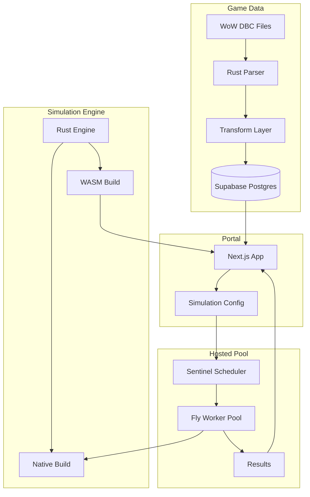

Why simulate WoW combat at all, what value does it provide to players, the gap between theorycrafting spreadsheets and full discrete simulation, history of WoW simulation tools (SimulationCraft, Raidbots), what WoW Lab aims to do differently (source available, community-driven, sustainable).

## Problem Statement

The core challenges: extracting and maintaining game data from undocumented DBC files across patches, accurately modeling combat mechanics with thousands of interacting spells/auras/procs, achieving statistical significance in reasonable time (performance), making simulation accessible to non-technical players, scaling compute between the browser (free tier) and a hosted pool (paid tier).

## Solution Approach

High-level overview of the solution: a Rust-based discrete event simulation engine compiled to both native (for the hosted pool) and WASM (for browser), a data pipeline from DBC files through transformation to Postgres, a Next.js portal for configuration and visualization, a sentinel-scheduled pool of trusted workers on Fly for paid users, real-time coordination through Centrifugo.

<Figure id="solution-architecture">

</Figure>
