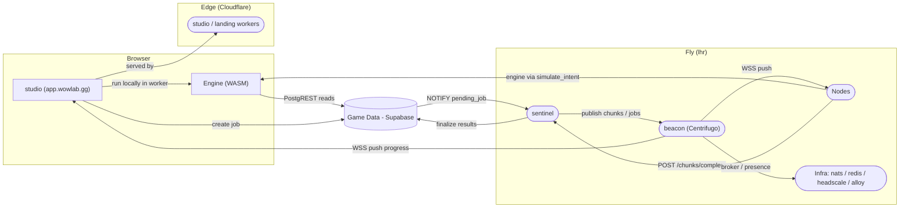
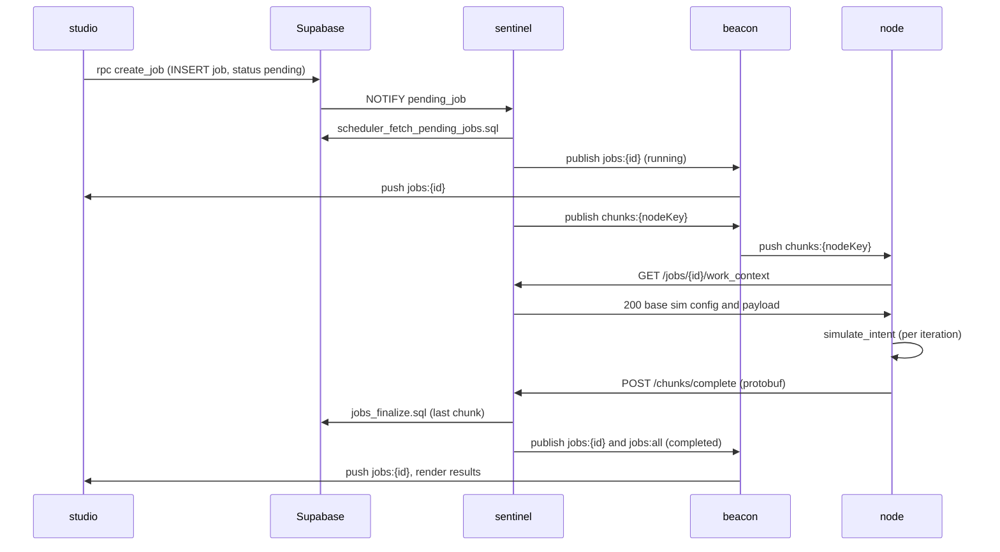
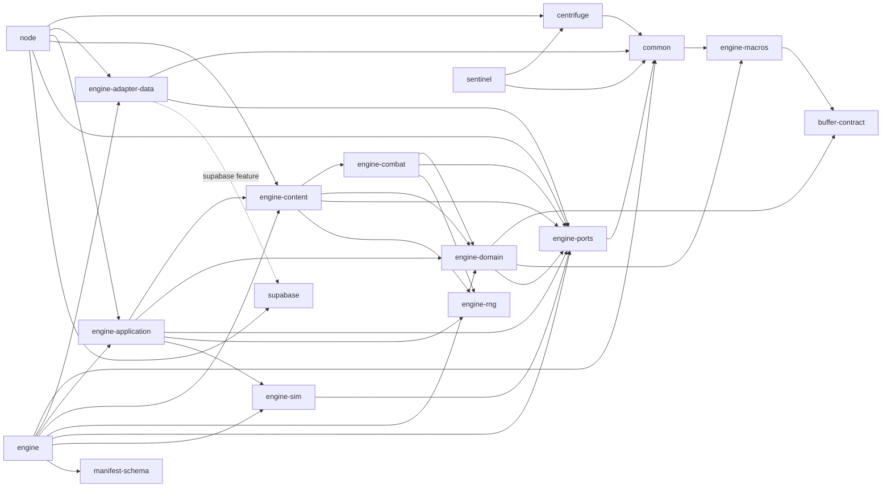

A simulation is a pure function: gear and talents and a rotation go in, a damage distribution comes out. Everything on this page exists to run that function in two places, inside your browser tab, and across a fleet of machines other people lend us, and to make sure both places give you the same answer.

That single idea is the easiest way to hold the platform in your head. The browser is the free tier: it owns the engine as a WebAssembly module and runs it in a worker, no account required. The hosted tier is for jobs too large to wait on a laptop for. Those get split into pieces and farmed out to community compute. The only thing that differs between the two is where the engine runs and where the result lands, because both paths call the exact same Rust entry point:

{/* docref fn overview-arch-simulate-intent */}

Everything else on this page is the plumbing that gets a TOML config and a resolver to that function and gets the result back.

<Figure id="sys-context">

</Figure>

The boxes in that figure are the canonical units of this whole reference. Every later section zooms into exactly one of them: the <Term id="resolver">Game Data</Term> box opens up in [data resolution](/dev/bible/game-data/data-resolution), the Engine box in [the simulation core](/dev/bible/engine/discrete-event-simulation), the beacon box in [realtime](/dev/bible/distribution/realtime), and the Nodes box in [hosted compute](/dev/bible/distribution/hosted-compute). I will name the parent box whenever a figure expands one, so you can always trace a detail back up to this map.

The names are worth fixing now, because they recur verbatim:

- **Browser**: the `studio` app at `app.wowlab.gg`, plus the **Engine** compiled to WebAssembly and run in web workers.
- **Edge (Cloudflare)**: the Cloudflare Workers (OpenNext) that serve `studio` and the `landing` marketing site.
- **Game Data (Supabase)**: the Postgres database. It holds both the read-only `game.*` schema (spells, items, specs) and the `public` operational tables (jobs, nodes).
- **Engine**: the Rust simulation engine. The same code, whether compiled to WASM for the browser or to a native binary on a node.
- **<Term id="sentinel">sentinel</Term>**: the scheduler. One Fly.io process that listens for new jobs, splits them into chunks, assigns them to nodes, ingests completions, and finalizes results.
- **<Term id="beacon">beacon (Centrifugo)</Term>**: the realtime pub/sub server. Everything that needs to push a message to a browser or a node goes through it.
- **<Term id="node">Nodes</Term>**: the community compute. Worker processes (or browser tabs) that subscribe to a channel, run the engine, and report back.
- **Infra**: `nats` (the beacon's broker), `redis` (the beacon's presence store), `headscale` (the mesh control plane for burst nodes), and `alloy` (metrics shipping).

## The two execution paths

The reason there are two paths is a deliberate trade-off, not an accident of growth. I wanted the tool to be genuinely free to use without an account, and a modern laptop can run a small simulation in seconds. So the browser owns a full copy of the engine. But a stat-weight scan or a gear tournament can be hundreds of thousands of iterations, and at that scale you want more cores than one tab has. Rather than rent a server farm, the platform lets the community contribute compute and pools it. The cost of this choice is real: there are now two runtimes to keep in lockstep, two telemetry-decode paths, and a whole distribution layer that the free path doesn't need. The mitigation is that both paths compile the _same_ engine and call the _same_ entry point, so the simulation result cannot diverge between them.

### Free / WASM path

In the browser, the engine and the shared `wowlab-common` crate are compiled to WebAssembly with `wasm-pack` and loaded into web workers, wrapped with Comlink. The worker calls `runSimulation` / `runSimulationWithProgress`, thin `#[wasm_bindgen]` wrappers that build a `ChunkAssignment` and hand it to `simulate_intent`. Game data is fetched on demand through a JavaScript resolver, a three-layer cache of in-memory `Map`, IndexedDB, and Supabase PostgREST that the Rust side calls back into across the boundary. One constraint shapes this path: WASM has no LLVM, so the in-browser engine uses portable rotation bytecode rather than the JIT. The full boundary is the subject of [the WASM boundary](/dev/bible/distribution/wasm-boundary).

### Hosted node path

A hosted job takes the long way around. The browser writes a job row to Supabase; a database trigger fires `NOTIFY pending_job`; the sentinel, which is listening, wakes up, splits the job into chunks, and publishes each chunk to a node over the beacon. The node fetches its work context, runs `simulate_intent` once per iteration, signs the protobuf result, and POSTs it back. The sentinel aggregates, and when the last chunk lands it writes the final result and pushes a "completed" message to the browser. The native node uses the LLVM JIT, the `SupabaseResolver` over a three-layer cache, and a tokio worker pool. The detail lives in [orchestration](/dev/bible/distribution/orchestration) and [hosted compute](/dev/bible/distribution/hosted-compute); the map is the next figure.

## The job lifecycle

The clearest way to see the hosted path is to follow one job from the moment you click "simulate" to the moment results tick in. Every arrow below is a real call: an endpoint, a Postgres channel, or a Centrifugo channel, not an idealized sketch.

<Figure id="job-lifecycle">

</Figure>

A few things in that sequence are load-bearing and easy to miss. The Postgres channel is `pending_job`, singular. The unit of distribution is a <Term id="chunk">chunk</Term>: the sentinel splits a job into `ChunkAssignment`s and publishes each to exactly one node's channel, `chunks:{nodePublicKey}`. The node never gets the full sim config over the channel. It gets a small assignment, then pulls the real work context separately, authorized against an in-memory claim. Completions come back as a protobuf `BatchChunkCompletion` to `POST /chunks/complete`, Ed25519-signed over the request body. And critically, the authority for in-flight jobs is an **in-memory store on the sentinel**, not the database. Only the final `result_pb` and `timeline_pb` are ever written to Postgres, via `jobs_finalize.sql`. That choice keeps the hot loop off the database, at the cost of losing all in-flight state if the sentinel restarts; on restart it deliberately fails any job still marked `running`.

Browser tabs participate in this exact same loop. A tab that has joined as a worker subscribes to its own `chunks:{publicKey}` channel and POSTs signed completions back, identically to a native node. To the sentinel, a browser node and a Fly node are the same thing.

## The Rust workspace

The Engine box in the system context is not one crate. It is about two dozen, and the split is the part most worth understanding, because it is the reason the same engine can run in a browser and on a server without conditional compilation creeping into the simulation logic.

<Figure id="crate-graph">

</Figure>

The figure above expands the **Engine** box of the system-context diagram. The layering reads bottom-up. `engine-ports` and `engine-domain` are the foundation: ports are the trait boundaries (the `DataResolver` for game data, the `SpecHandler` for combat logic, the `Event` and `SimState` types), and the domain holds the core simulation types and the rotation engine. `engine-rng` is a tiny leaf crate with no dependencies at all: the deterministic `SimRng` and the stochastic sampling primitives, factored out so any layer that needs reproducible rolls can pull it without dragging in the rest of the engine. `engine-sim` is the scheduler, the timing-wheel event queue and the run loop, and it depends on ports plus the shared `common` crate, but on no combat, content, or domain crate, so it knows nothing about combat formulas or spell data. `engine-combat` and `engine-content` layer the actual mechanics and per-spec handlers on top. `engine-application` is the orchestration layer that wires data resolution to handler construction to the run loop; it is what exposes `simulate_intent`. The host shells, the `node` worker, the `sentinel` scheduler, and the WASM `engine` cdylib, sit at the very top and contribute the I/O.

The payoff of this is direct: the simulation core (`engine-sim`, `engine-domain`, `engine-ports`, `engine-rng`) depends on no I/O at all. None of these crates know what a database is. `engine-ports` defines the `DataResolver` trait and a transport-agnostic `ResolverError` (its backend-failure variant is a plain `String`, not an SDK type), so the ports layer no longer links the Supabase crate; only the concrete adapter does, and only behind its `supabase` feature. Game data arrives through the `DataResolver` port, so whether the bytes came from Supabase, a local CSV file, or a JavaScript callback in a browser worker is invisible to the simulation. That is what lets the identical engine run in both execution paths. The cost is the usual one for clean architecture: more crates, more trait indirection, and a dependency graph you have to actually read to navigate. I think it has paid for itself; the [resolver layer](/dev/bible/game-data/data-resolution) is the clearest example of it doing so.

One edge in the figure is dashed for a reason. `engine-application` is the layer that orchestrates the sim, and it has no runtime dependency on any concrete resolver: it talks to data purely through the `DataResolver` port. The concrete `engine-adapter-data` crate is wired in only as a `[dev-dependency]` of the application crate (so its tests can resolve real data) and as a real dependency of the host shells that actually do I/O (`engine`, `node`). That keeps the application layer honest about the boundary.

What runs where, and why, is the platform in one table:

<BibleTable id="components-overview">

| Component           | Where it runs                              | What it is                                    | Why there                                                              |
| ------------------- | ------------------------------------------ | --------------------------------------------- | ---------------------------------------------------------------------- |
| studio              | Cloudflare Workers (OpenNext), global edge | The auth app at `app.wowlab.gg`               | Edge for low-latency global delivery                                   |
| landing             | Cloudflare Workers, global edge            | The marketing site at `wowlab.gg`             | Same edge runtime as studio                                            |
| Engine              | Browser (WASM) + native nodes              | The Rust simulation engine                    | Same code both paths; WASM for the free tier, native for hosted        |
| sentinel            | Fly.io, `lhr`                              | Scheduler, HTTP API, Discord bot, cron, MCP   | Co-located with beacon, nats, and Supabase for the NOTIFY/publish loop |
| beacon (Centrifugo) | Fly.io, `lhr`                              | Realtime pub/sub server (Centrifugo v6)       | Near sentinel and nats for the realtime hot path                       |
| Nodes               | Fly.io `lhr`, Latitude.sh, or browsers     | Community compute that runs the engine        | Where spare cores are; browser tabs and rented metal both qualify      |
| nats                | Fly.io, `lhr`                              | The beacon's pub/sub broker                   | Must be co-located with beacon                                         |
| redis               | External                                   | The beacon's presence store                   | Online-node roster, separate from the broker                           |
| headscale           | Fly.io, `lhr`                              | Self-hosted mesh control plane                | Secure mesh for burst/external nodes                                   |
| alloy               | Fly.io, `lhr`                              | Metrics and log shipper to Grafana            | Scrapes the internal Fly DNS of sentinel and beacon                    |
| Game Data           | Supabase cloud                             | Postgres: `game.*` data + `public` jobs/nodes | Single source for both read-only game data and operational state       |

</BibleTable>

One detail in that table answers a question people ask: the beacon is backed by **both** NATS and Redis, for different jobs. NATS is the broker that fans out publications; Redis is the presence manager that tracks which nodes are online. They are not redundant. They back different subsystems.

## Where the simulation actually is

Everything above is plumbing around a `for` loop. The engine is a [discrete-event simulation](/dev/bible/engine/discrete-event-simulation): a <Term id="des">DES</Term> that pops time-ordered events from a queue, advances a virtual clock to each event's timestamp, and asks a per-spec handler what to do next. It is a pure scheduler. The run loop computes no damage; all combat logic lives in the handler. Each iteration is one Monte-Carlo combat run with its own deterministic RNG, and a chunk runs many of them sequentially, accumulating a distribution. Run enough iterations and the noise averages out into a stable DPS estimate with confidence intervals. That loop, the timing wheel that drives it, the rotation compiler that decides each action, and the combat formulas that resolve each cast are the subject of [the engine section](/dev/bible/engine/discrete-event-simulation). The data those formulas read, every spell coefficient and item scaling curve and talent, comes from the [game data layer](/dev/bible/game-data/dbc-overview), which is where the reference goes next.
