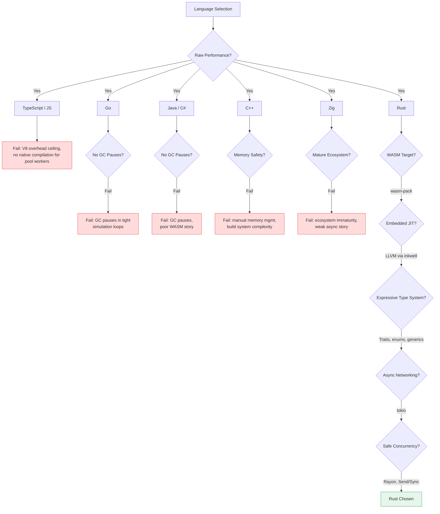

Languages evaluated for the simulation engine and why each was considered and ultimately rejected or chosen. The key requirements: raw performance for tight simulation loops, WASM compilation for the browser-side engine, memory safety without garbage collection pauses, ergonomic type system for modeling game mechanics, ecosystem for async networking (the hosted pool).

Why not C++ (memory safety, build system complexity, WASM story), why not Go (GC pauses in tight loops, no WASM at the time, less expressive type system), why not TypeScript/JavaScript (performance ceiling, no native compilation for nodes), why not Zig (ecosystem maturity, async story), why not Java/C# (GC, WASM story).

Why Rust: zero-cost abstractions, trait system for spec polymorphism, fearless concurrency with Rayon, first-class WASM target via wasm-pack, LLVM as an embedded JIT compiler via inkwell, strong ecosystem (tokio, serde, prost), single language for engine + pool workers + sentinel + CLI, compile-time guarantees (no null pointers, no data races), performance parity with C/C++.

<Figure id="language-decision-matrix">

</Figure>

The trade-offs accepted: steep learning curve, longer compilation times, borrow checker friction in graph-like game state, less hiring pool than mainstream languages.
