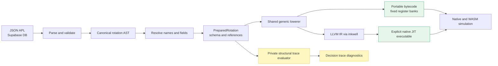

The rotation language problem: users need to express complex priority-based decision logic (if cooldown ready and buff active and resource > 50 then cast X), it must be evaluable millions of times per simulation, it must be authorable by non-programmers, it must be validatable before execution, it must be serializable for storage and sharing.

Scripting languages tried and why they failed: Lua (embedding overhead, sandbox escapes, GC pressure in hot loop, poor WASM story), Rhai (too slow for millions of evaluations per second, dynamic typing overhead), custom interpreted DSL (still too slow, interpretation overhead dominates at scale), expression trees with eval (better but still branch-heavy).

Why APL (Action Priority List): simple mental model (ordered list of conditions → actions), natural fit for WoW combat (priority-based not scripted), established convention from SimulationCraft, flat structure maps well to UI (drag-drop reordering, condition editors).

The compiled solution: the engine validates one JSON AST into a prepared rotation, then lowers that artifact once into portable typed bytecode or, when explicitly selected in a native build, LLVM machine code through inkwell. Portable bytecode is the normal native and WASM path and reuses fixed register banks without traversing the AST. Explicit decision tracing alone uses a private structural reference evaluator so diagnostics remain complete. Schema validation rejects unresolved identities and invalid buffer coordinates before any executable is returned.

<Figure id="rotation-compilation-pipeline">

</Figure>

<Figure id="scripting-language-evolution">

</Figure>

```mermaid
flowchart LR

    lua["Lua embedding"] -->|Rejected| lua_why["Embedding overhead<br/>sandbox escapes<br/>GC in hot loop<br/>poor WASM story"]
    lua_why --> rhai

    rhai["Rhai scripting"] -->|Rejected| rhai_why["Dynamic typing and hot-loop overhead"]
    rhai_why --> dsl

    dsl["Custom interpreted DSL"] -->|Rejected| dsl_why["Interpretation overhead dominates at scale"]
    dsl_why --> expr

    expr["Expression trees and eval"] -->|Rejected| expr_why["Better but still branch-heavy"]
    expr_why --> apl

    apl["JSON action priority list"] --> prepared["Prepared rotation"]
    prepared --> portable["Portable bytecode"]
    prepared --> jit["Explicit LLVM JIT"]
    portable --> result["Compiled once<br/>schema validated<br/>serializable JSON"]
    jit --> result

    classDef md-red fill:#ffdbdc,stroke:#e5484d
    classDef md-neutral fill:#f9f9fb,stroke:#cdced6
    classDef md-green fill:#e6f6eb,stroke:#30a46c
    class lua,rhai,dsl,expr md-red
    class lua_why,rhai_why,dsl_why,expr_why md-neutral
    class apl,prepared,portable,jit,result md-green
```

Roads not taken: full scripting language (too complex for users, security concerns), visual node graph (Unreal Blueprint-style, too heavyweight), SimC APL text format (parsing fragility, no structured editing).
