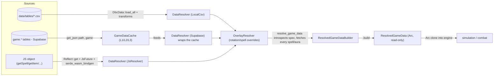
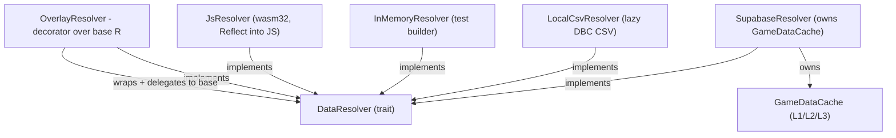
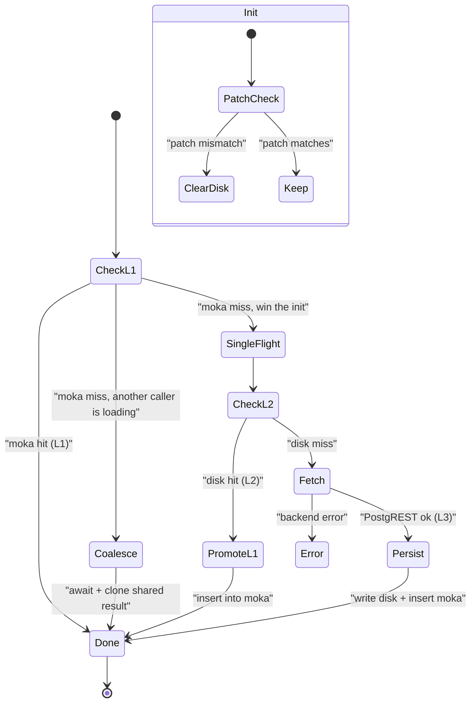

The engine never asks "where does this spell's data live?" It asks "give me spell 12345," and one trait answers, regardless of whether the bytes come from a CSV file, a Postgres mirror, a binary cache, or a JavaScript object in a browser tab. That trait is the <Term id="resolver">resolver</Term>, and this page is the hinge of the whole data layer: it is where the four sources of the previous pages converge into one interface, and where that interface gets folded into the single read-only view the simulation runs on.

The figure below expands the **Game Data** box of the system-context diagram in [Architecture](/dev/bible/overview/architecture). Read it left to right: sources on the left, the `DataResolver` trait in the middle erasing their differences, and the resolution pass on the right collapsing everything into `ResolvedGameData`.

<Figure id="data-resolution">

</Figure>

## The port: `DataResolver`

`DataResolver` is an async trait. Every backend implements the same handful of required methods, `get_spell`, `get_spell_effect`, `get_item`, `get_scaling_data`, `get_power_types`, `get_spec`, `get_trait_tree`, `get_rotation_script`, and inherits default bodies for the rest. `get_spells` batches over `get_spell`, `decode_traits` composes the loadout functions from [Talent Trees](/dev/bible/game-data/talent-trees), and so on. The defaults that an incapable backend inherits fail loud rather than masquerading as data: `get_spell_overrides` and `search_spells` default to `ResolverError::Unsupported`, and `get_expected_stats`, `get_item_damage_scaling`, and `get_enchantment` default to their respective not-found errors. A backend that genuinely has no override table returns `Ok(vec![])` explicitly; one that cannot answer at all stays distinguishable from it.

Making an async trait usable as a trait object is otherwise impossible, so two attribute macros do the work:

{/* docref code data-resolution-trait-macros */}

`trait_variant::make(Send)` produces a `Send` variant on native targets, while on wasm32 the futures are intentionally left `!Send` because the browser is single-threaded and demanding `Send` there buys nothing. The variant is `Send` but not `Send + Sync`: the single-flight cache adapter (`moka::try_get_with`) yields a `Send` but `!Sync` future, so the trait drops the `Sync` bound and keeps `&self` `Send` through a `ResolverSyncBound` supertrait instead. Then `dynosaur::dynosaur` generates `DynDataResolver`, the boxed, dyn-compatible wrapper that the rest of the engine passes around. `DynDataResolver::new_box`, `new_arc`, and `from_ref` are the three ways a concrete resolver gets erased.

Failures flow through one `#[non_exhaustive]` `ResolverError` enum with a variant for each kind of miss, `SpellNotFound`, `ItemNotFound`, `TraitTreeNotFound`, and so on, plus an `Unsupported { method }` variant for an unanswerable default and transport errors for IO and the JS bridge. Crucially there is no Supabase-specific variant: `engine-ports` does not depend on the `supabase` infrastructure crate at all. A backend's transport failure is flattened into a generic `Backend(String)` at the adapter boundary, so the port stays ignorant of which concrete backend produced it. Because the enum is non-exhaustive, adding a new backend's error mode does not break existing matches.

## The five backends

There are five implementations, and the choice among them is entirely a function of _where the process runs_, not of any runtime configuration the user sees. The figure below sets the backends against the trait they all implement, and against the `OverlayResolver` decorator that wraps any of them.

<Figure id="resolver-backends">

</Figure>

<BibleTable id="gamedata-resolvers">

| Impl                 | Source                                          | Where it runs                   | File                 |
| -------------------- | ----------------------------------------------- | ------------------------------- | -------------------- |
| `SupabaseResolver`   | `game.*` over PostgREST, via `GameDataCache`    | nodes, server-side              | `remote/supabase.rs` |
| `LocalCsvResolver`   | `DbcData` from CSV, transformed lazily          | CLI, forge, dev                 | `local/csv.rs`       |
| `JsResolver`         | a JS object's `getSpell`/`getItem`/… promises   | browser (WASM)                  | `bridge/js.rs`       |
| `OverlayResolver<R>` | decorates any base `R` with in-memory overrides | everywhere overrides are needed | `bridge/overlay.rs`  |
| `InMemoryResolver`   | hand-built maps                                 | tests                           | `in_memory.rs`       |

</BibleTable>

`OverlayResolver` is the one that is not a source at all. It is a decorator that wraps another resolver and shadows specific spells, effects, or rotation scripts from in-memory maps before delegating the rest to the base. That is how a custom rotation or a tweaked spell gets injected without touching the underlying data, which the CLI, forge, and the WASM path all rely on. Its whole state is the base plus three override maps:

{/* docref struct data-resolution-overlay-struct */}

The decorator overrides exactly three lookups, `get_spell`, `get_spell_effect`/`get_spell_effects`, and `get_rotation_script`; _every other method must explicitly forward to the base_. That is not free: a default trait body would otherwise apply, so a method the overlay forgets to delegate would silently regress a capable base (say, Supabase) down to the trait's loud default. So `get_item_damage_scaling`, `get_enchantment`, `search_spells`, and the rest all hand straight through to base, and a test asserts each one returns the base's answer rather than the default.

Two honest naming and behaviour notes, because the code does not match every casual description of it:

- The Supabase backend is `SupabaseResolver`, not "RemoteSupabaseResolver". There is no type by the latter name. It is a thin wrapper whose only field is a `GameDataCache`.
- Its rotation queries use a different schema from everything else. Every game-data fetch goes through `get_json(path, "game")`, setting an `Accept-Profile: game` header, but `get_rotation_script` and `get_assisted_rotation` use plain `client().get(path)` with no profile header, so they read the `rotations` table from the default (public) schema. The split is deliberate, rotations are user content, not game data, but it is easy to miss when reading the resolver as "all PostgREST."

The WASM backend resolves everything through the JS object: `get_spell`, `get_item`, `get_scaling_data`, `get_power_types`, `get_spec`, `get_trait_tree`, and `get_rotation_script` each call the correspondingly named method on the object (`getSpell`, `getTraitTree`, and so on) and deserialize the result, while `get_spell_effect`/`get_spell_effects` derive from the fetched spell. The one method it opts out of is `get_spell_overrides`, which returns an empty result because the browser applies overrides client-side. I trace the JS object protocol in [WASM Boundary](/dev/bible/distribution/wasm-boundary).

## The three-layer cache

`SupabaseResolver` is fast only because it almost never hits the network. Its `GameDataCache` is a read-through cache with three layers, and the state machine below expands the **GameDataCache** box of the resolution figure above.

<Figure id="cache-layers">

</Figure>

Spells, traits, items, and specs all flow through one generic path, `get_cached(mem_cache, disk_category, key, fetch)`. The body is the whole three-layer story, and it is now a single Moka `try_get_with` call:

{/* docref code data-resolution-cache-read-through */}

`try_get_with` is the L1 lookup _and_ the single-flight gate in one. On a hit it returns the cached value; on a miss it runs the init closure exactly once per key, even under concurrency, so a thundering herd of cold callers all await the same load instead of each firing its own request. Inside that closure the rest of the story unfolds: fall back to the **L2 disk JSON** file, and only on a disk miss issue the **L3 PostgREST** request, write the result to disk, and let `try_get_with` promote it into L1. The Moka caches are capacity-bounded; spells cap at 50,000 entries.

Invalidation is by patch version. On construction the cache reads `{cache_dir}/patch_version`, and if it does not match the requested patch it clears the entire disk cache. A patch bump throws away everything stale in one step rather than trying to diff individual rows.

Two paths sidestep the per-id machinery, and they are worth knowing:

- **Scaling data is fetched as eleven parallel requests.** `get_scaling_data` issues one `futures::try_join!` over all eleven scaling tables, `item_bonuses`, `curves`, `curve_points`, `rand_prop_points`, `item_scaling_configs`, `item_offset_curves`, `item_squish_eras`, `combat_ratings`, `hp_per_sta`, `spell_scaling`, and `combat_ratings_mult_by_ilvl`, and folds them with the `ItemScalingData::from_flat` constructor from [Items and Scaling](/dev/bible/game-data/items-and-scaling). It is still single-flighted: the bundle lives in its own capacity-1 Moka cache keyed by `()`, so concurrent cold callers coalesce into one download of all eleven tables rather than every caller re-fetching them. It has its own disk-cache file too, so the eleven requests only ever fire on a true cold start.
- **Power types are not cached at all.** `get_power_types` issues a fresh request every call. There are few power types and they are read rarely, so the cache bookkeeping was not worth it, a small and deliberate exception.

## Folding it all into `ResolvedGameData`

The resolver answers per-spell questions, but the engine wants one consolidated, immutable view of every number for the spec it is about to simulate. `resolve_game_data`, in `engine-application/src/game_data.rs`, builds it. The key idea is that it does not fetch a fixed list of spells. It asks the spec what it uses, then fetches exactly that.

This module owns only the async fan-out over the port: it introspects the spec handler to discover every spell, aura, and auto-attack id it references, unions in the talent, item, and spell-override ids, and then walks that set, awaiting the resolver for each. The per-spell DBC arithmetic that turns a raw `SpellDataFlat` into costs, gains, and coefficients is _not_ here; those decode helpers (`primary_cost`, `primary_resource_gain`, `spell_props_from`, and the trigger-chain payload extraction) live a layer down in `engine-domain::dbc::decode`, so the application layer stays a pure fan-out and the number-crunching stays pure and testable. For each spell it records the props and walks effects 1 through 5 for AP/SP coefficients and base points; for each aura it records duration, stacks, tick period, and pandemic behaviour.

The output is <Term id="resolved-game-data">`ResolvedGameData`</Term>, an `Arc`-wrapped, cheap-to-clone, read-only value. Inside it, each keyed table is a `ResolvedMap<K, V>` that makes one subtle distinction explicit: an _empty_ map means "no data was resolved for this run" (introspection mode), so every key resolves to a neutral default; a _populated_ map is authoritative, so a present key yields its value and an absent key yields `None`. That single type is what lets a caller tell "this spec never used that spell" apart from "that spell's value is the neutral default", a convention that used to be an unwritten empty-vs-populated rule scattered across accessors. Because the build is driven by what the spec actually needs, an unused spell never costs a fetch, a property that matters most over the network. The full pass, and how generated code reads back from this value, is the subject of [Codegen](/dev/bible/game-data/codegen).
