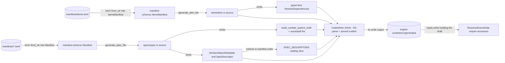

A spec, say Arcane Mage, is defined in two places, and the split is the whole point. The numbers (a cooldown, a coefficient, an aura duration) live in the game data and reach the engine through `ResolvedGameData`. The _behaviour_ is hand-written in a small TOML manifest: which spells exist, which auras they apply, which talents matter. Code generation stitches the two together: it reads the manifest and emits Rust that, at build time, pulls the omitted numbers out of `ResolvedGameData`. A manifest is therefore almost all structure and almost no numbers; anything it leaves out is resolved from data.

This figure expands the **Engine** box of the system-context diagram in [Architecture](/dev/bible/overview/architecture), showing the build-time half of that picture: manifests in, generated Rust out.

<Figure id="codegen-pipeline">

</Figure>

## The schema: `manifest-schema`

`manifest-schema` is the canonical, serde-only definition of what a manifest may contain. It is shared by both the generator and forge's audit tooling, so there is exactly one description of the format. A per-spec manifest deserializes into `Manifest`; items deserialize into `ItemsManifest`. Every manifest carries a `schema_version`, checked against a `CURRENT_SCHEMA_VERSION` constant so a format change fails loudly rather than generating wrong code.

The per-spec `Manifest` mirrors a spec's combat definition:

{/* docref struct codegen-manifest */}

Each section deserializes into its own struct. The recurring theme is that almost every field on a spell or aura is `Option`, and an absent value means "resolve from game data."

<BibleTable id="gamedata-manifest-sections">

| Section                           | Type                               | Holds                                                                 |
| --------------------------------- | ---------------------------------- | --------------------------------------------------------------------- |
| `spec`                            | `SpecSection`                      | WoW spec id, pet flag, custom handler, precombat/stealth auras        |
| `resource`                        | `ResourceSection`                  | name, max, regen, starts_at, type id                                  |
| `secondary_resource`              | `Option<SecondaryResourceSection>` | name, max, type id only, no regen                                     |
| `auras`                           | `IndexMap<String, AuraDef>`        | aura defs; declaration order = `LocalAuraIdx`                         |
| `spells`                          | `IndexMap<String, SpellDef>`       | spell defs; declaration order = `LocalSpellIdx`                       |
| `auto_attacks`                    | `IndexMap<String, AutoAttackDef>`  | swing timers and AP coefficients                                      |
| `talents` / `hero_talents`        | `BTreeMap` / `IndexMap`            | talent name-to-id maps                                                |
| `effects`                         | `IndexMap<String, EffectRef>`      | named `(spell_id, effect)` pairs; generated into an `EFFECT::` module |
| `metric_keys` / `rotation_schema` | optional sections                  | telemetry keys and rotation field schema                              |

</BibleTable>

The `effects` section is worth singling out. An `EffectRef` is just a `(spell_id, effect)` pair given a name, and the generator stamps it into a per-spec `EFFECT::` module beside the `SPELL`/`AURA`/`TALENT` modules. That replaced a class of hand-maintained effect-index `const`s that used to live loose in the spec hooks: the index now sits in the manifest right next to the id it indexes, one source of truth that both the generated code and the hand-written hook read.

A `SpellDef` carries `id` and then a long list of optional overrides:

{/* docref struct codegen-spell-def */}

Cooldown, cost, gain, damage, cast time, GCD, charges, the applied aura, AoE and channel sub-sections, cooldown-reduction rules, and a `hook` for custom behaviour are all here, and all optional. In a real manifest most of them are absent: the Arcane Mage manifest declares ten spells and fourteen auras where almost every spell gives only its `id` and lets the generator pull cooldown, cost, cast time, and damage from data. The manifest says _what the spec does_; the data says _by how much_.

## The generator: `codegen-cli`

The `codegen` binary is invoked as `cargo codegen` and writes into `crates/engine-content/src/generated/`. Its driver, `generate_all`, reads every `*.toml` in the manifests directory, treats `items.toml` specially, parses each spec file into a `Manifest`, version-checks it, and calls `generate_spec_file`. It then emits the items, the barrel `mod.rs` files, and finally writes every `(filename, source)` pair to disk. A `--check` mode regenerates in memory and diffs against the committed files, so CI can prove the generated code is in sync with the manifests without a writable tree.

`generate_spec_file` emits, in order: the id constants (the `SPELL`/`AURA`/`TALENT` and `EFFECT` modules), ordered complete spell and aura resolution-id slices, the local-index constants, one `aura_*` and one `spell_*` builder function per declaration, the `build_combat_system_draft` function, the handler factory, and one typed `DeclaredSpecMetadata` value in a `SpecDescriptor`. The generated barrel collects all 27 descriptors into one `SPEC_DESCRIPTORS` slice in manifest-repository order. Engine Content combines that slice with item and expansion-trait resolver dependencies into the single validated `ContentCatalog` used for lookup and iteration.

### How the source is emitted

The generator accumulates source text through `CodeWriter`, while the small `Chain` helper builds method-call expressions and tracks which calls need `?`. When a file is done, `CodeWriter::finish` validates the accumulated source with `ra_ap_syntax`, normalizes numeric literals, formats it with the workspace toolchain's pinned `rustfmt`, and parses the formatted result again. Parse and formatter failures are returned as contextual errors without dumping the generated buffer, so invalid output aborts the complete in-memory generation pass before any files are written. Banner comments are retained across formatting and restored in their required position.

Items go down the same chute. An item's on-use or proc spell is emitted by the very same `spell_chain` the spec generator uses, parameterised through a `SpellChainOpts` so the item path can reproduce its slightly leaner chain without a second copy of the logic. Per-item combat registration is a single `register_item!` macro call rather than a stamped-out block, so an item file is mostly its id, name, and the one chain. The item barrel separately emits typed `ResolveDependencies` in item-manifest order, making the resolver inputs part of the same catalog contract as spec metadata.

## The build-time override versus run-time accessor loop

The connective idea is worth stating precisely, because it is the reason the two halves stay consistent. When a manifest field is present, the generator emits a literal. When it is absent, the generator emits a _call into `ResolvedGameData`_ instead. The altitude of those calls is higher than it once was. Rather than the generator inlining a sprawl of per-spell `data.cooldown_s(...)`, `data.cost(...)`, and target/multiplier lookups, the bulk now collapses to a handful of `*_from_data` builder methods that take the resolved data and the spell id and do the lookups themselves: `apply_base_from_data` pulls cooldown, cost, cast time, and the rest of the base profile; `apply_aoe_from_data` pulls the target count and chain multiplier; `damage_ap_from_data` / `damage_sp_from_data` pull the damage coefficient; and on the aura side `AuraBuilder::apply_base_from_data` mirrors the spell case. These live in `engine-combat`, so the per-spell ceremony moved out of the generated text and into a runtime helper called once per spell. The generated Arcane Mage code, accordingly, reads as one fluent line per spell, like `s.apply_base_from_data(data, 1449)?.apply_aoe_from_data(data, 1449, 0)`, rather than a paragraph of inlined field reads.

That `?` is the second half of the consistency story. The accessors used to inline a full `MissingSpellData { spell_id, field }` literal at every call site, hundreds of times across the generated tree. They are now `ResolvedGameData::require_*` accessors that materialize that error once, internally, and return a `Result`. A spell whose data never resolved therefore fails the build of the combat system through one `?`, rather than silently simulating zeros, with none of the per-call-site error boilerplate.

That closes the loop with [Data Resolution](/dev/bible/game-data/data-resolution). At build-combat-system time, the generated builder functions read coefficients, costs, cooldowns, and durations from `ResolvedGameData`; at resolution time, `resolve_game_data` populated that value from the catalog descriptor's generated `DeclaredSpecMetadata`. The manifest is the override layer on top, and the game data is the default underneath. Add a number to the manifest and it wins; omit it and the data fills in. Both halves share the same generated declaration, so the ids the resolver fetches are exactly the ids the builders use. This is the boundary between the data layer and the engine: from here on, every page assumes the engine is holding a fully resolved `ResolvedGameData` and a cataloged spec, and asks what it does with them.
