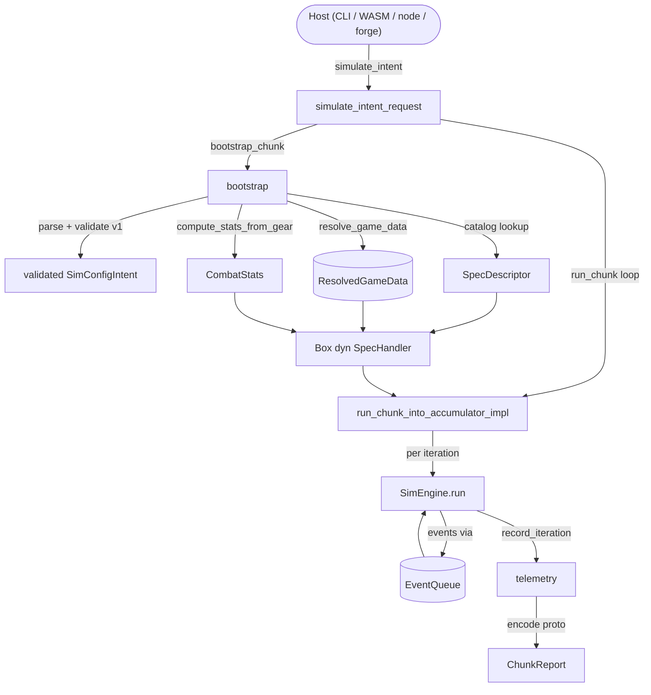

The engine never ticks. It keeps a queue of future <Term id="des">events</Term> sorted by time, pops the earliest one, jumps the clock straight to that event's timestamp, and asks a handler what to do. Nothing happens between events because, by construction, nothing _can_ happen between events.

That single sentence is the whole mental model. Everything below earns the detail.

## Why not a fixed time step

The naive way to simulate combat is a fixed-step loop: advance a millisecond, check what's due, advance another millisecond. It is simple and wrong in two directions at once. Most milliseconds have nothing due, so you burn cycles on empty ticks; and anything finer than your step (a tick that lands at 1.5 ms past a step boundary) gets quantised to the grid. A combat sim spends almost all of its wall-clock time idle between a cast finishing and the next global cooldown expiring. For a fixed-step loop that idle time is pure overhead.

Discrete event simulation inverts the loop. Instead of asking "what time is it now, and what is due?" it asks "what is the next thing that happens, and when?" Time advances in one jump to that event. A 300-second encounter that resolves in a few thousand events touches a few thousand timestamps, not 300,000 milliseconds. This is the standard event-driven formulation of simulation; none of it is novel here, and I lean on the simulation literature rather than reinventing it.

The trade-off is that you give up the implicit ordering a tick loop gives you for free. With discrete events you have to keep the event set sorted yourself, and you have to be deliberate about ties (two events at the same millisecond). The engine solves ordering with a [timing wheel](/dev/bible/engine/event-system) and breaks ties FIFO by insertion sequence.

## The engine is a pure scheduler

The second design commitment is that the loop knows nothing about combat. It understands eight [event variants](/dev/bible/engine/event-system) and a `SimState` clock, and it dispatches to a `SpecHandler` trait object. The fields of `SimEngine` say it plainly: a queue, a clock, telemetry, the handler, a sink, and the encounter end. Nothing about damage, auras, resources, or cooldowns, and notably no RNG, the loop schedules and dispatches; it never rolls a die:

{/* docref struct des-sim-engine-struct */}

All the combat logic lives behind that `SpecHandler` trait in `engine-combat`. The loop's only jobs are: pop the next event, advance the clock, call the matching handler method, and drain whatever the handler scheduled back into the queue.

This split is what lets the same loop drive any spec. The handler is the spec; the loop is the clock. It also keeps the loop trivially testable in isolation. A mock handler that schedules a few events exercises every branch without a single line of game data.

`SimTime` is the unit of that clock: a `u32` of **milliseconds**, nothing more.

{/* docref struct des-sim-time-struct */}

Not seconds, not floats. Integer milliseconds, so event timestamps are exact and the timing wheel can index them directly. The conversion to real seconds only happens when a rate like DPS or regen needs it, and it divides by a thousand right there at the read site.

## One iteration, end to end

A single Monte-Carlo run is one combat from `t = 0` to the encounter end. The host (CLI, browser worker, compute node, or the `forge` profiler) does not call the loop directly. It calls `simulate_intent`, which parses the sim config, resolves all game data, builds the handler, and only then drives the loop once per iteration.

<Figure id="sim-pipeline">

</Figure>

This figure expands the **Engine** box of the system-context diagram (see [Architecture](/dev/bible/overview/architecture)). Reading it left-to-right and top-to-bottom:

- `simulate_intent` is a thin convenience wrapper; it packs its arguments into a `SimRequest` with default overrides and forwards to `simulate_intent_request`.
- `bootstrap` is the heavy lifting: parse the TOML, require `intent_version == "v1"`, resolve the spec, find its descriptor in the canonical content catalog, turn gear into stats, and resolve every spell and aura the spec touches into a `ResolvedGameData` snapshot. Game-data resolution is its own subject, covered under [Data Resolution](/dev/bible/game-data/data-resolution).
- The descriptor's factory builds the handler from the resolved data and stats. This is where the [generated spec code](/dev/bible/engine/spec-handlers) meets the runtime.
- `run_chunk` then runs the iteration loop, each pass invoking `SimEngine::run` against the shared `EventQueue`, accumulating into one `TelemetryAccumulator`, and finally encoding a `ChunkReport` of protobuf telemetry bytes.

The unit of work here is the **<Term id="chunk">chunk</Term>**: a `ChunkAssignment` declares some number of iterations, and the chunk runs them sequentially in one thread, reusing one handler, one queue, and one sink across all of them. The chunk is also the atomic unit of distribution. The [orchestration](/dev/bible/distribution/orchestration) and [hosted-compute](/dev/bible/distribution/hosted-compute) pages pick up the story from there.

The next page opens the **SimEngine.run** box: the eight event variants, the dispatch loop, the timing wheel, and the deterministic RNG that makes a run reproducible from its seed.
