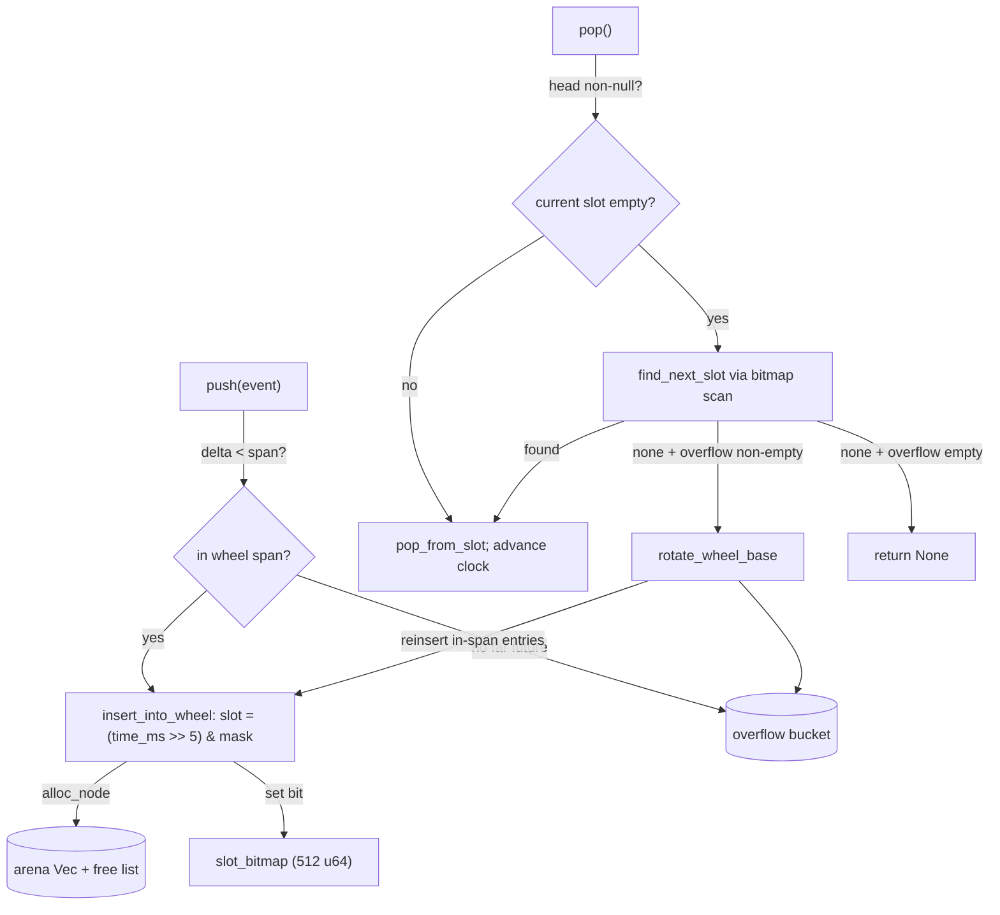

The run loop is a `while` over a queue: pop the earliest event, advance the clock to it, call the handler method for its variant, drain whatever the handler scheduled, repeat. Every event carries a timestamp; the queue keeps them sorted; the loop never looks ahead. That is the entire executor.

This page expands the **SimEngine.run** box of the [sim-pipeline figure](/dev/bible/engine/discrete-event-simulation). I cover the events themselves, the dispatch state machine, the queue that orders them, and the RNG that makes a run reproducible.

## The eight events

`Event` is the central type the whole loop is built around. It is `Copy`, matched exhaustively in-workspace, and every variant carries a `t: SimTime` so the queue can sort on it without inspecting the payload.

<BibleTable id="event-variants">

| Variant         | Payload             | Meaning                                                           |
| --------------- | ------------------- | ----------------------------------------------------------------- |
| `PlayerReady`   | `t`                 | Rotation wake: ask the handler for the next action                |
| `OffGcdReady`   | `t`                 | Off-GCD rotation wake; dispatched identically to `PlayerReady`    |
| `CastStart`     | `t`, `spell_id`     | Cast begins. The loop computes cast time and schedules completion |
| `CastComplete`  | `t`, `spell_id`     | Cast lands. Damage, auras, cost, and cooldown all resolve here    |
| `AuraTick`      | `t`, `aura_id`      | Periodic DoT/HoT tick, or a channel tick (channels reuse the id)  |
| `AuraExpire`    | `t`, `aura_id`      | Aura expiry check (may be a no-op if the aura was refreshed)      |
| `CooldownReady` | `t`, `cooldown_key` | A cooldown or charge has recharged                                |
| `AutoAttack`    | `t`                 | A melee swing is due                                              |

</BibleTable>

Because `t` sits in every variant, the queue never has to know which variant it holds. `Event::timestamp` collapses all eight into one match and hands back the `t`:

{/* docref fn event-system-timestamp */}

One detail is worth flagging because the code contradicts its own doc comment. The doc on `CastStart` says cooldown and resource cost are "paid here". They are not. In the actual loop, the `CastStart` arm only asks the handler for the cast time and schedules a `CastComplete` at `t + cast_ms`:

{/* docref code event-system-cast-start-arm */}

All of the cost, cooldown, damage, and aura work runs at `CastComplete`, inside [`process_cast`](/dev/bible/engine/cast-pipeline). The doc comment is stale relative to the code, and the code wins.

## The dispatch loop

The handler talks back to the loop through `SpecAction`, returned only from `on_player_ready`. It has two cases:

{/* docref enum event-system-spec-action */}

The loop turns a `Cast` into a `CastStart` event and a `Wait` into a future `PlayerReady`; everything else the handler wants to schedule it pushes through `flush_scheduled`, which the loop drains after every arm.

```mermaid
stateDiagram-v2

    [*] --> PlayerReady: "on_sim_start; push PlayerReady(0)"
    PlayerReady --> CastStart: "Cast{spell}; push CastStart"
    PlayerReady --> PlayerReady: "Wait{until}; push PlayerReady(until)"
    PlayerReady --> Idle: "action None"
    CastStart --> CastComplete: "cast_time_ms; push CastComplete(t+cast)"
    CastComplete --> PlayerReady: "process_cast schedules ready(gcd_end)"
    CastComplete --> CooldownReady: "start_cooldown"
    CastComplete --> AuraTick: "apply_aura schedules tick"
    CastComplete --> AuraExpire: "apply_aura schedules expire"
    AuraTick --> AuraTick: "reschedule next tick before expiry"
    AuraExpire --> Removed: "expire_aura_by_id"
    CooldownReady --> Recharged: "check_recharge"
    AutoAttack --> AutoAttack: "reschedule next swing"
    CastComplete --> [*]: "t >= encounter_end"
    PlayerReady --> Budget: "event count > 500000"
    Budget --> [*]: "EventBudgetExceeded"
```

<Figure id="event-loop-state">

</Figure>

This figure expands the **SimEngine.run** box of the [sim-pipeline figure](/dev/bible/engine/discrete-event-simulation). The states are the event variants; the transitions are real scheduling edges:

- The loop seeds itself: after `on_sim_start`, it pushes `PlayerReady { t: 0 }` to kick off the rotation.
- `PlayerReady` (and the identical `OffGcdReady`) call `on_player_ready`. A `Cast` becomes a `CastStart`; a `Wait` becomes a clamped future `PlayerReady`; `None` schedules nothing.
- `CastStart` schedules `CastComplete` at `t + cast_ms`.
- `CastComplete` runs `process_cast`, which is where the fan-out happens. It schedules the next `PlayerReady`, starts cooldowns (`CooldownReady`), and applies auras that schedule their own `AuraTick` and `AuraExpire` events.
- `AuraTick` reschedules itself against live haste until the next tick would land past expiry; `AutoAttack` reschedules the next swing.

There are two terminals. The normal one: a popped event whose `t >= encounter_end_ms` breaks the loop, the fight is over, stop. The failure one: a hard budget of `MAX_EVENTS = 500_000`. If a run processes that many events without finishing, the loop returns `SimRunError::EventBudgetExceeded`. That cap is a guard against a pathological rotation scheduling itself into a tight non-advancing loop; it does not normally fire.

## The timing wheel

The queue is the part that earns its keep. With discrete events you push and pop constantly, and both have to respect time order. The obvious structure is a binary heap, O(log n) push and pop, simple to reason about. The engine uses a **<Term id="timing-wheel">timing wheel</Term>** instead, trading the heap's clean asymptotics for O(1) amortised push and pop. The standard reference for the structure is Varghese and Lauck.<Cite id="varghese1987">Hashed and Hierarchical Timing Wheels</Cite>

The shape is fixed: 32768 slots, each spanning 32 ms (`WHEEL_SHIFT = 5`, so `1 << 5 = 32`), for a wheel span of about 17.5 minutes. Each slot is the head of an arena-allocated linked list, kept sorted by `(time_ms, seq)`. A 512-word bitmap (one bit per slot) lets the pop path skip empty slots with a `trailing_zeros` scan instead of walking them one at a time.

<Figure id="timing-wheel">

</Figure>

This figure expands the **EventQueue** box of the [sim-pipeline figure](/dev/bible/engine/discrete-event-simulation). The mechanics:

- **push** computes the timestamp's slot. If the event lands beyond the wheel's span (`time_ms - wheel_base_ms >= WHEEL_SPAN_MS`), it goes into an overflow bucket instead. Otherwise it is inserted into the slot's linked list at the right sorted position, a fast tail append in the common case, a list walk otherwise. Nodes come from an arena with a free list, so steady-state pushing does not allocate.
- **pop** reads the current slot's head; if empty it scans the bitmap for the next non-empty slot. If no slot has anything but overflow does, it rotates.
- **rotate_wheel_base** advances the wheel base by one full span, resets the slot cursor, and drains the overflow bucket, reinserting every entry that now falls within the new span and leaving the rest in overflow. This is how a 30-minute DoT survives a 17.5-minute wheel: it sits in overflow until rotation brings it into range.

Ordering is ascending `time_ms`, FIFO by an insertion `seq` on ties. The FIFO tiebreak is the only thing the wheel adds over a plain heap to make same-millisecond events deterministic, and it matters: two procs firing at the same instant must resolve in a fixed order or the run is not reproducible.

The honest cost of this choice: the wheel is bigger and more code than a heap, and its O(1) is amortised, not worst-case. A burst of far-future events all landing in overflow, then a rotation, pays for itself across many ops rather than per-op. For a workload that is overwhelmingly near-future scheduling with the occasional long DoT, that trade is worth it.

## Deterministic RNG

A simulation result has to be reproducible from its seed, or you cannot debug it and you cannot trust a regression. The RNG lives in its own leaf crate, `engine-rng`, with no dependencies, so any layer can pull it without dragging in the scheduler. It is `SimRng`, a `u64` xorshift64 generator (shifts 13/7/17), seeded by an FNV-1a hash over `seed_base || chunk_id || iteration_index`. The whole generator is one word of state:

{/* docref struct sim-rng-struct */}

The seed pipeline is split deliberately. `seed_prefix(seed_base, chunk_id)` pre-hashes the per-chunk part once:

{/* docref fn sim-rng-seed-prefix */}

and `from_prefix(prefix, iteration_index)` finishes it per iteration, so the chunk loop does not re-hash the whole key on every Monte-Carlo pass:

{/* docref code chunk-seed-derivation */}

On top of the raw generator sit the stochastic primitives in `crates/engine-rng/src/stochastic.rs`: `proc_chance` (a flat roll), `roll_tier` (cumulative thresholds), `shuffle_pick` (partial Fisher-Yates), and `roll_rppm`, real-procs-per-minute with same-time guarding, a 3.5-second elapsed cap, and bad-luck protection that ramps the chance up the longer a proc has gone without firing. [Procs](/dev/bible/engine/procs) covers the RPPM model in depth.

One subtlety the crate split makes clean: the RNG is not the scheduler's concern. `SimEngine` holds no `SimRng` field at all, it only schedules and dispatches. The RNG that actually drives combat rolls is the handler's own `SimRng`, reseeded per iteration from the seed pipeline above. Keeping it in the handler rather than the loop is what makes a run reproducible from its seed regardless of event ordering.

With the clock, the queue, and the RNG in place, the only remaining question is what the handler does when asked for the next action. That answer comes from the [rotation compiler](/dev/bible/engine/rotation-compiler).
