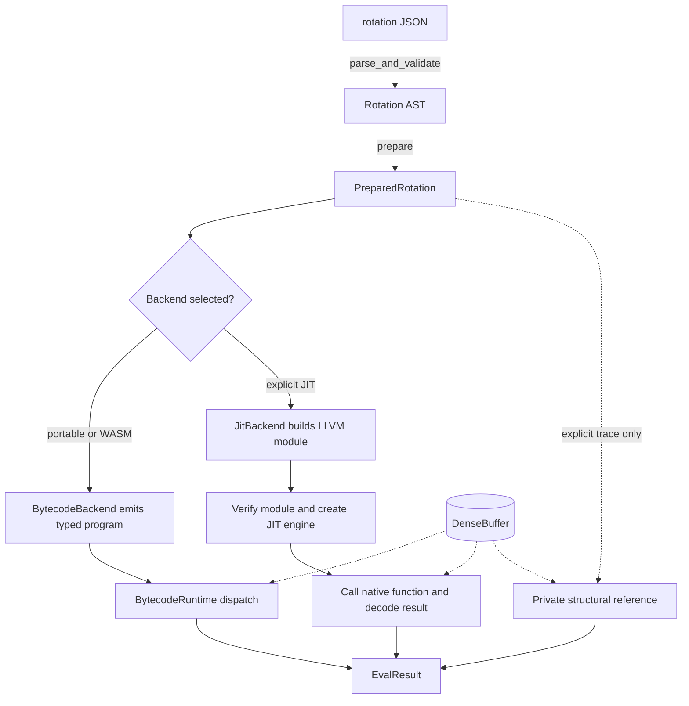
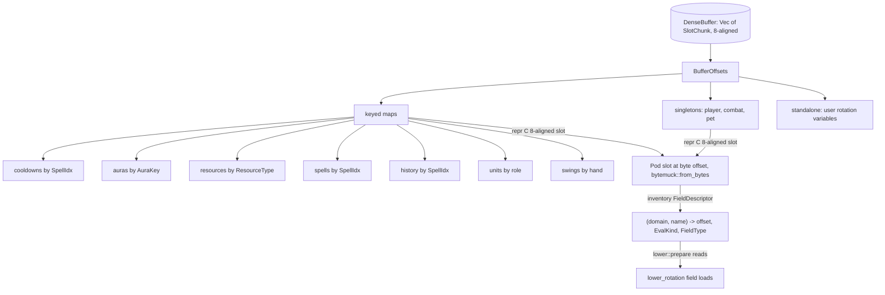
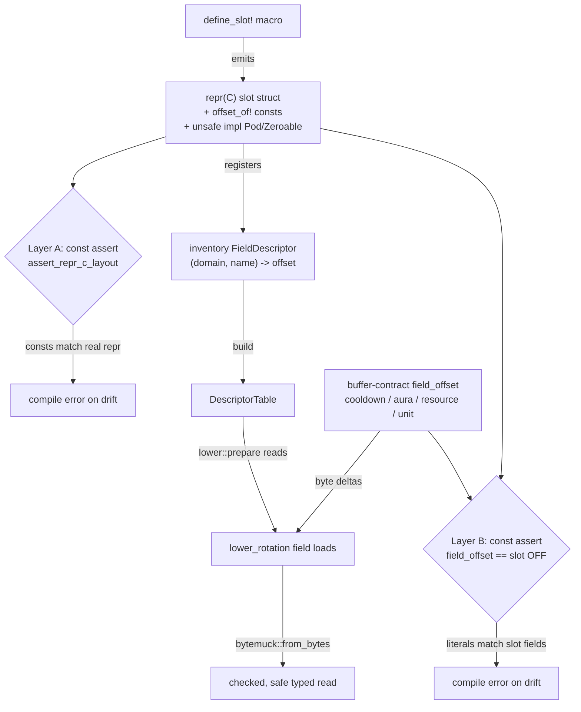

When the loop asks the handler "what now?", the answer comes from a rotation: a priority list of actions with conditions, authored as JSON and compiled once at bootstrap. At runtime the handler calls `evaluate(&mut buffer, now_secs)` and gets back a single `EvalResult`: cast this spell, wait this long, pool to this resource level. That is the contract. Everything below is how it is honoured fast and identically across two backends.

This page expands the **Engine** box of the system-context diagram (see [Architecture](/dev/bible/overview/architecture)) along a different axis than the [event system](/dev/bible/engine/event-system): the rotation execution path rather than the clock.

## Prepared once, lowered to one selected backend

Every rotation is first converted into one immutable `PreparedRotation`: the validated canonical source, resolved descriptor table, complete spell-reference inventory, and a `ContextSchema` whose buffer coordinates have already been checked. Both production compilers consume that same artifact through the same generic `lower::lower_rotation` pipeline:

- Portable bytecode is the ordinary backend for non-JIT and WASM builds. Compilation emits typed instructions and register IDs once; evaluation reuses preallocated boolean, integer, and float register banks without traversing the source or allocating.
- Native hosts may explicitly select the <Term id="jit">JIT</Term> backend, which compiles the prepared rotation to native machine code through LLVM via `inkwell`. If selected JIT construction fails, construction fails; there is no silent portable fallback.
- Attaching a decision-trace sink keeps the selected production executable intact. The trace request explicitly invokes a private structural reference path so it can record each decision; that path is not an ordinary backend or selector.

The thing that makes two backends maintainable is that they are not two implementations. Both call the **same** `lower::lower_rotation`. The lowerer is generic over a `RotationBackend` trait whose associated types are the backend's notion of a boolean, integer, and float:

{/* docref code rotation-compiler-backend-trait */}

The trait's methods are the primitive operations the lowerer composes: load a field, compare, add, branch, return a cast. The JIT implements those primitives by emitting LLVM IR; the bytecode backend emits portable typed instructions. The priority-list logic, which condition gates which action and what counts as a terminator, is written exactly once. Focused differential tests pin numeric edge cases, short-circuit behavior, spell usability, and buffer mutations across portable bytecode, JIT, and the private structural reference.

Portable evaluation is deliberately small: `BytecodeRuntime` walks an immutable `BytecodeProgram` and dispatches its exhaustive instruction enum into reusable typed register banks. The source tree, resolver, and lowering algorithm are not touched during ordinary evaluation:

{/* docref code rotation-compiler-portable-evaluate */}

This makes the browser path deterministic and allocation-free without maintaining a second implementation of rotation semantics.

<Figure id="rotation-compile">

</Figure>

This figure expands the **Engine** box of the system-context diagram (see [Architecture](/dev/bible/overview/architecture)). The pipeline:

- `parse_and_validate` is serde plus a validation pass over the action tree. The pass enforces a real recursion-depth bound on condition nesting (`MAX_CONDITION_DEPTH`); a tree nested past it is rejected with `ValidationError::MaxDepthExceeded` before lowering, so a pathological rotation can never recurse the lowerer into a stack overflow.
- Preparation builds the `DescriptorTable`, registers every field and user variable, validates referenced identities and every buffer coordinate, and freezes the `ContextSchema` plus complete resolved references.
- Both production compiler arms consume the **same** prepared artifact and converge on the **same** `lower_rotation`. The portable arm emits an immutable bytecode program; the JIT arm verifies its module and creates an execution engine.
- At runtime, `evaluate(buffer, now)` either dispatches portable instructions against reusable register banks or calls the native function and decodes its result. Neither ordinary path traverses or lowers the source.

A note on the road not taken: the obvious alternative JIT backend in the Rust ecosystem is Cranelift, which is simpler to embed and compiles faster. The engine uses LLVM through `inkwell` instead. It is slower to compile but better at optimising the kind of branch-heavy, read-only numeric code a rotation lowers to, and the rotation is compiled once per sim and then evaluated millions of times, so compile time is amortised to nothing.

## The EvalResult ABI

`EvalResult` is the value the rotation returns and the handler acts on. The in-memory form is a `#[repr(C)]` 12-byte triple, with a `const_assert_eq!` pinning the size at 12:

{/* docref struct rotation-compiler-eval-result */}

The `kind` byte is one of five constants: `KIND_NONE`, `KIND_CAST`, `KIND_WAIT`, `KIND_POOL`, `KIND_USE_ITEM`. The `spell_id` and `wait_time` fields mean different things per kind, which is why their doc comments hedge: for a use-item result `spell_id` carries the `GearSlot` repr instead of a spell id, and for a pool result `wait_time` is the target level.

The JIT does not return that struct directly. A native function returns a scalar, so the rotation function returns a `u64` with the same three fields bit-packed: `[kind:8][spell_id:24][wait_time:32]`. `pack_eval_result` builds it; `decode_eval_result` is the inverse, called right after the JIT call:

{/* docref fn rotation-compiler-decode */}

Note the packed spell id is 24 bits, narrower than the struct's `u32`. That is fine for live spell ids, and it is the only place the two representations differ. This packing lives in `buffer-contract`, the crate that holds the ABI both the lowerer and the backends agree on.

## The dense buffer

The rotation reads game state, and how that state is laid out is the difference between a 1.5 ns evaluation and a slow one. State lives in a `DenseBuffer`: one contiguous `Vec<SlotChunk>`, where `SlotChunk` is a `repr(C, align(8))` 8-byte newtype that derives `bytemuck::Pod` and `Zeroable`, so the buffer is 8-byte-aligned where a plain `Vec<u8>` would not be. The buffer is viewed as raw bytes and divided into slots, but the reads and writes go through `bytemuck` (`from_bytes` / `from_bytes_mut` / `split_at_mut`), not hand-written pointer casts: every slot type is `Pod`, so reinterpreting its bytes is safe by construction and the old `slot_ptr!` raw-pointer unsafe is gone. No hash lookups during evaluation, no boxing, no indirection. The rotation function is handed a `*mut u8` and a known set of byte offsets, and it loads `f64`s and `i32`s straight out.

<Figure id="dense-buffer">

</Figure>

This figure expands the **DenseBuffer** box of the [rotation-compile figure](/dev/bible/engine/rotation-compiler) above. The model has three families of slot:

- **Singletons**, one each: `player`, `combat`, `pet`. The player slot holds GCD end, cast/channel end, haste, crit, mastery, attack power, level, and the boolean state flags (moving, alive, in combat, stealthed).
- **Keyed maps**, many of each, indexed by an integer or string key: cooldowns and spells and history by `SpellIdx`, auras by `AuraKey`, resources by `ResourceType`, units by role string, swings by hand. Each key maps to a byte offset into the same buffer.
- **Standalone**, the user's own rotation variables, defaulted on reset.

Every slot is a `repr(C)` struct generated by a `define_slot!` macro that also emits its field offsets, its size, and a set of `FieldDescriptor`s collected through the `inventory` crate. A `FieldDescriptor` records `(domain, name) -> (field_offset, eval_kind, field_type)`. That descriptor table is exactly what `lower::prepare` consults to turn a rotation's `Read { field: "cooldown.fireball.remaining" }` into a concrete byte load with the right `EvalKind`.

`EvalKind` is where the buffer's expressiveness lives. One stored field can expose several named rotation expressions with different evaluation semantics:

{/* docref enum rotation-compiler-eval-kind */}

An aura slot stores a single `expires_at` deadline, but the rotation can ask for `is_active` (`TimestampActive`), `remaining` (`TimestampRemaining`), `elapsed` (`TimestampElapsed`), or `is_refreshable` (`AuraRefreshable`, true when `remaining < 0.3 * base_duration`). A resource slot stores `current`, `max`, and `regen`, and the rotation reads `deficit`, `pct`, `deficit_pct`, or `time_to_max` off them. The deadline-and-now arithmetic happens at evaluation; the buffer stores only the raw state.

Two correctness guards keep this honest, and a third now lives in the type system. At compile time, every slot's declared layout is checked against its actual `repr(C)` layout by `assert_repr_c_layout`, which recomputes offsets, size, and alignment from the field list, asserts they match, and rejects any field whose alignment exceeds the slot's 8-byte alignment. The per-domain byte offsets the lowerer reads against, `field_offset::{cooldown, aura, resource, unit}` in `buffer-contract`, are the only hand-written byte numbers in the subsystem, and a second layer of `const _: () = assert!()` pins each one to the matching `repr(C)` slot field. At runtime, the slot accessor no longer dereferences a raw pointer at all: `bytemuck::from_bytes` checks both length and alignment before it hands back the typed reference, so a misaligned or out-of-bounds access is a panic, not undefined behaviour. The buffer is fast because it is flat; it is correct because the layout is asserted at compile time and every reinterpretation is a checked, safe `bytemuck` call rather than an `unsafe` cast.

A pair of `#[repr(transparent)]` newtypes keeps the descriptor plumbing from confusing one small integer for another: `DescriptorId(u16)` is a descriptor's stable index in the table, and `ByteOffset(usize)` is an offset into the buffer. Both are zero-cost over their scalar, so the ABI is unchanged; they exist only to make the offset arithmetic type-checked.

The thing to see is that three crates that never reference each other's internals all agree on the same byte layout, and every link in that agreement is a compile error if it drifts:

<Figure id="buffer-abi-pins">

</Figure>

This figure expands the **DenseBuffer** box of the [rotation-compile figure](/dev/bible/engine/rotation-compiler). Layer A proves the `offset_of!` consts match the struct's real `repr(C)` layout; Layer B pins the five hand-written `field_offset` literals to those consts. Once both asserts hold, the lowerer can compute every field's byte position from those numbers and read it back through a checked `bytemuck::from_bytes`, with no `unsafe` and no possibility of a silently wrong offset.

The buffer is what the combat system reads and writes during a fight. The next page, the [cast pipeline](/dev/bible/engine/cast-pipeline), is what actually mutates those slots when a spell lands.
