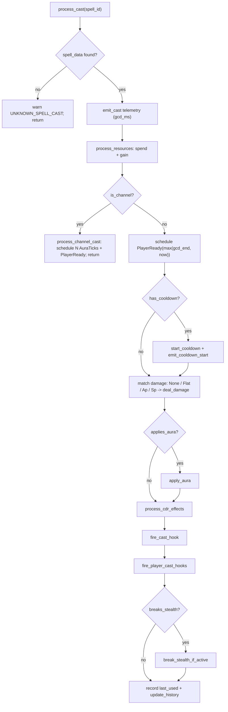

When a `CastComplete` event pops, the handler runs `process_cast`. This is the function that turns "the cast finished" into all of its consequences: the resource is spent, the cooldown starts, the damage is dealt, the aura is applied, post-cast hooks fire. It runs once per landed cast, top to bottom, no surprises.

The very first thing it does is refuse to trust its input. An unknown spell id is logged and dropped, never a panic:

{/* docref code cast-pipeline-lookup-guard */}

Despite the doc comment on `CastStart` claiming cost and cooldown are "paid" at cast start, none of that happens until here at `CastComplete`. The `CastStart` arm of the loop only schedules this completion; this is where the spell actually does anything.

## The thirteen steps

The pipeline is deliberately linear, a sequence of steps, not a graph, which makes it readable and makes the per-step attribution exact.

<Figure id="process-cast">

</Figure>

This figure expands the **SimEngine.run** box of the [sim-pipeline figure](/dev/bible/engine/discrete-event-simulation). Specifically, it is the `on_cast_complete` callback the loop makes there. Step by step, with call sites:

1. **Lookup.** Fetch the spell's static `SpellData` by id. If it is missing, warn `UNKNOWN_SPELL_CAST` and return: a cast for an unknown spell is a no-op, not a panic.
2. **Cast telemetry.** Compute the effective GCD and emit a cast event carrying it. This is the GCD's only role in `process_cast`. It is reported, not enforced here, because the GCD gate already happened in `on_player_ready` before the cast was returned.
3. **Resources.** `process_resources` spends the primary and secondary cost and applies any energise gain, detailed below.
4. **Channel branch.** If the spell is a channel, `process_channel_cast` schedules the channel's ticks and the final rotation wake, then returns early. Channels do not run the rest of this pipeline the same way.
5. **Schedule the next wake.** Push a `PlayerReady` at `max(gcd_end, now)` so the rotation is asked for its next action when the GCD clears.
6. **Cooldown.** If the spell has a cooldown, start it and emit a cooldown-start event.
7. **Damage.** Match on the spell's `DamageDef`: `None` does nothing; `Flat` emits a fixed-amount damage event and fires impact procs; `ApCoefficient` and `SpCoefficient` route to `deal_damage_ap` / `deal_damage_sp`, which run the full [damage formula](/dev/bible/engine/combat-formulas).
8. **Aura.** If the spell applies an aura, `apply_aura` runs the [aura state machine](/dev/bible/engine/auras): fresh apply, pandemic refresh, or snapshot.
9. **Cooldown reduction.** `process_cdr_effects` walks the spell's CDR effects and hands each to `apply_cdr_effect`, which branches on the condition: `Always`, `ProcChance`, and `WhileAuraActive` gate a fixed-amount _reduction_, while `ResetWhileAura` fully _resets_ the target cooldown when its aura is active. Reduce-versus-reset is an explicit fork in `apply_cdr_effect`, not a "condition" that quietly mutates.
10. **Cast hook.** `fire_cast_hook` runs the spell-specific post-cast hook, if any.
11. **Player cast hooks.** `fire_player_cast_hooks` runs every registered global cast hook.
12. **Break stealth.** If the spell breaks stealth, expire the stealth aura.
13. **Record.** Stamp the spell's `last_used` and update the history slot's prev-GCD flags so the rotation can reason about what was cast last.

The order is not arbitrary. Resources spend before damage so a starved cast still pays its cost. The cooldown starts before damage so a cooldown-reducing impact proc cannot reduce a cooldown that has not begun. Hooks fire after damage and auras so they observe the post-cast state. The history update is last so it reflects a completed cast.

## Resource accounting

The resource step has more nuance than "subtract the cost." `process_resources` calls `process_single_resource` twice, once for the primary resource and once for the secondary. For each, if there is a cost it is spent and a `Spend` event emitted. If there is a gain it is granted and a `Gain { wasted }` event emitted, where `wasted` is the overflow past the resource cap.

Two exceptions change the primary cost before the spend, not after. A cost-bypass aura zeroes the cost while it is active, the mechanic behind "your next spell is free" procs. And a channel pays per tick rather than up front, so its per-cast primary cost is zero. Both checks live at the top of `process_resources`:

{/* docref fn cast-pipeline-process-resources */}

The handler also keeps the resource current with the clock. Before evaluating the rotation, `on_player_ready` calls `sync_resource`, which regenerates the primary resource up to `now`, scaling regen by haste for resources that haste affects. Resource regeneration is continuous in the game but the sim only needs the value at decision points, so it lazily catches up the resource at each wake instead of scheduling a tick for every point of energy. This is the same idea as the discrete-event loop itself: compute state when it is read, not on a fixed grid.

The remaining mechanics, the [damage multiplier chain](/dev/bible/engine/combat-formulas), the [aura lifecycle](/dev/bible/engine/auras), [procs](/dev/bible/engine/procs), and [resources](/dev/bible/engine/resources), are the subject of the following pages. What ties them together is covered under [spec handlers](/dev/bible/engine/spec-handlers): how a generated spec becomes the `SpecHandler` this pipeline lives inside.
