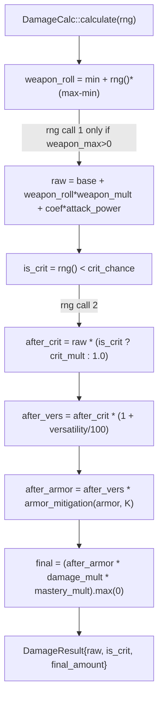

Every damage number in the engine comes out of one function: `DamageCalc::calculate`. It takes the spell's base amount and a handful of stat inputs and walks them through a fixed multiplier chain: weapon roll, raw damage, crit, versatility, armor, then the situational multipliers. The order matters, and the engine commits to one.

This is the [cast pipeline](/dev/bible/engine/cast-pipeline)'s damage step, zoomed in. The figure below expands the **SimEngine.run** box of the simulation pipeline (the Zoom-1 `sim-pipeline` figure); concretely it is what `process_cast` reaches when it hits the damage branch.

<Figure id="damage-pipeline">



</Figure>

## The chain, step by step

`DamageCalc` is a plain struct of inputs. Everything the formula needs is a field on it:

{/* docref struct combat-formulas-damage-calc-struct */}

`calculate(rng)` consumes them in this exact order, drawing from the RNG at most twice:

1. **Weapon roll.** `weapon_roll = weapon_min + rng()*(weapon_max - weapon_min)`, but only when `weapon_max > 0`. For a spell with no weapon component the roll is skipped entirely, including the RNG call, so the first random draw belongs to crit instead.
2. **Raw.** `raw = base + weapon_roll*weapon_multiplier + coefficient*attack_power`. This folds the flat base, the rolled weapon contribution, and the attack-power-scaled portion into one number before any multiplier touches it.
3. **Crit.** `is_crit = rng() < crit_chance.clamp(0,1)`; the factor is `crit_multiplier` on a crit, else `1.0`. The default crit multiplier is `2.0`.
4. **Crit applied.** `after_crit = raw * crit_factor`.
5. **Versatility.** `after_vers = after_crit * (1 + versatility/100)`.
6. **Armor.** `after_armor = after_vers * armor_mitigation(target_armor, armor_k)`.
7. **Multipliers.** `final_amount = (after_armor * damage_multiplier * mastery_mult).max(0)`, where the floor at zero is the only clamp on the result.

The output is a `DamageResult { raw, is_crit, final_amount }`. Note that crit, versatility, and the late multipliers are all multiplicative against the same `raw`; there is no additive bucketing here. That is a simplification, since real WoW splits modifiers into additive and multiplicative buckets, but for the spells the engine models it keeps the formula auditable.

## Armor mitigation

Armor only applies to physical damage, and it uses the standard ratio:

```
armor_mitigation(armor, K) = 1 - armor / (armor + K)
```

In code that ratio is clamped to `[0, 1]` and short-circuits to `1.0`, meaning no mitigation, when armor is non-positive:

{/* docref fn combat-formulas-armor-mitigation */}

The constant `K` is the armor coefficient for the target's level, supplied as `armor_k = game_data.armor_k()`, which is `armor_constant * armor_constant_mod` resolved from the expected-stats table. Non-physical schools skip the armor term: `prepare_damage_setup` only reads target armor for physical hits.

## Where the inputs come from

`DamageCalc` is assembled in `prepare_damage_setup`, which reads the player's crit and versatility, the target armor for physical hits, the spell's base points, and then two aggregates: the buff totals and the mastery multiplier.

### Buff totals

Finalization classifies each `BuffEffect` and binds only totals-relevant aura slots into the immutable effect plan. At runtime, `buff_totals` folds static contributions into actor-revision caches, evaluates only planned dynamic callbacks for the current target, and scales each contribution directly by its live stack count. The `BuffEffect` enum is the vocabulary of what an aura can change:

<BibleTable id="buff-effect-variants">

| Variant                                  | Effect                                    |
| ---------------------------------------- | ----------------------------------------- |
| `Haste(f64)`                             | additive haste percent                    |
| `Crit(f64)`                              | additive crit percent                     |
| `Mastery(f64)`                           | additive mastery percent                  |
| `Versatility(f64)`                       | additive versatility percent              |
| `PrimaryStat(f64)`                       | additive primary stat                     |
| `DamageMult(f64)`                        | flat damage multiplier on all damage      |
| `DamageMultSchool(f64, DamageSchool)`    | damage multiplier scoped to one school    |
| `DamageMultSpells(f64, &[u32])`          | damage multiplier scoped to a spell list  |
| `Cleave(f64, u8)`                        | extra cleave hits at a fraction of damage |
| `DamageMultStacking{initial, per_stack}` | multiplier that grows per stack           |

</BibleTable>

`BuffEffect` is `#[non_exhaustive]`, and its `scaled(stacks)` method is where the stack count actually applies. Additive stats scale linearly; the `DamageMult*` family compounds via `powf(stacks)` instead:

{/* docref fn combat-formulas-buff-effect-scaled */}

`BuffTotals` also keeps a per-school multiplier array `school_damage_mult: [f64; DAMAGE_SCHOOL_COUNT]` so school-scoped buffs land on the right hits; the length is `DamageSchool::COUNT` (derived by strum from the enum) rather than a hand-maintained literal, so adding a school can never silently index out of bounds.

### Mastery

Mastery is not one formula. It is per-spec, so the finalized `CombatProgram` carries the immutable `mastery_category` definition and the runtime applies it in two shapes:

- `MasteryCategory::UniformMult`: mastery multiplies all of the spec's damage equally.
- `MasteryCategory::SchoolMult`: mastery multiplies only a specific school.

The category is set at build time from the manifest (`mastery_category(params.mastery.category)`), and the resolved mastery percent comes from <Term id="stats">the stat recompute</Term>, scaled by the spec's mastery coefficient. This is deliberately coarse: most specs in WoW have a bespoke mastery, and the engine only models the two that fit a multiplier. Specs whose mastery does something structurally different (e.g. adds a proc, changes resource generation) need a hook, not a category.

## Dealing the hit

`DamageCalc::calculate` is the arithmetic; `deal_damage` is the orchestration around it. For a single-target cast it builds one `DamageCalc`, calls `.calculate(rng)`, adds the result to `state.total_damage`, emits a `DamageEvent` to the [telemetry sink](/dev/bible/engine/metrics), and fires impact <Term id="rppm">procs</Term> via `fire_impact_procs`. When the spell is flagged AoE it loops `run_single_hit` per target with a per-target multiplier (split, chain, or square-root falloff), and a single-target physical hit can still cleave extra hits when a `Cleave` buff is active.

Snapshot DoTs are the exception: `deal_damage_with_snapshot` feeds `DamageCalc` the AP/SP/crit/vers/mastery captured when the DoT was applied instead of the live stats. That mechanism is the subject of the [auras](/dev/bible/engine/auras) page.
