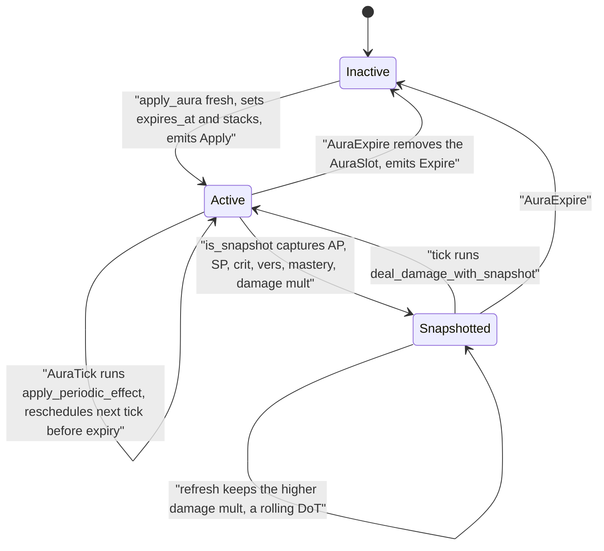

An aura is a timed effect on the player or target: a buff, a debuff, or a damage-over-time. Applying one is more than setting a flag. The engine has to decide whether this is a fresh application or a refresh, carry over the right amount of remaining duration, schedule periodic ticks, and queue an expiry. All of that lives in one function, `apply_aura`.

This figure expands the **SimEngine.run** box of the [simulation pipeline](/dev/bible/engine/discrete-event-simulation) (the Zoom-1 `sim-pipeline` figure): it is the state an aura moves through when `process_cast` reaches its aura step, and on every later `AuraTick`/`AuraExpire` event the loop delivers.

<Figure id="aura-lifecycle">



</Figure>

## What an aura is, statically

An aura's immutable definition is `AuraData`, a `Copy` struct: an `aura_id`, where it lands (`on: AuraOn`, player or target), a `base_duration_ms`, a `max_stacks`, a `pandemic` flag, up to four `BuffEffect`s, an optional `PeriodicData`, an optional spell-group membership, and an `is_snapshot` flag.

{/* docref struct auras-aura-data */}

The runtime side, `expires_at`, current `stacks`, next tick time, and captured snapshot stats, lives in the `AuraSlot` of the [DenseBuffer](/dev/bible/engine/rotation-compiler), keyed by aura. The split is deliberate: the static `AuraData` is shared and never mutated; only the per-slot buffer state changes during a sim.

The numeric properties (duration, max stacks, tick period, pandemic eligibility) are resolved from game data into `AuraProps` at bootstrap and folded into the static defs by the generated builder code, so the manifest only needs to override what differs from the DBC.

## Fresh application vs refresh

`apply_aura` is the whole state machine. The first branch is spell-group exclusivity (below); after that it splits on whether the aura is already active.

A permanent aura, `base_duration_ms == 0`, gets a sentinel far-future expiry from `PERMANENT_AURA_EXPIRES_AT_S` and never schedules an expire event. Otherwise:

- **Fresh** (slot inactive): set `expires_at = now + base_duration`, `stacks = 1`, and emit an `Apply` event to telemetry.
- **Refresh** (slot already active): this is where <Term id="pandemic">pandemic</Term> applies.

### Pandemic

When you refresh a DoT that still has time left, WoW lets you carry over a slice of the remaining duration instead of clipping it. The engine models this as a 30% carry:

```
new_expires_at = now + base_duration + min(remaining, base_duration * 0.30)
```

In the refresh branch that is `PANDEMIC_CARRY_PERCENT = 30`, clamped against the time actually remaining:

{/* docref code auras-pandemic-carry */}

On refresh the engine also bumps the stack count (up to `max_stacks`) and emits a `Refresh` event. The same 0.3 threshold is what the rotation compiler exposes to scripts as the `is_refreshable` field via `AURA_PANDEMIC_THRESHOLD`, so a rotation can ask "is this DoT inside its pandemic window" and get an answer consistent with how the engine will actually carry duration.

## Periodic ticks

If the aura carries a `PeriodicData`, `apply_aura` schedules the first `AuraTick` event, with the first interval scaled by current haste and quantized onto the millisecond grid `SimTime` uses. Each tick is handled by `process_single_aura_tick`, which applies the periodic effect and then reschedules the next tick re-scaled against live haste, but only if the next tick lands before the aura expires. The effect itself is one of:

<BibleTable id="periodic-kind-variants">

| Variant                        | Per-tick effect            |
| ------------------------------ | -------------------------- |
| `DamageAp{coef, is_physical}`  | attack-power-scaled damage |
| `DamageSp{coef, is_physical}`  | spell-power-scaled damage  |
| `ResourceGain{amount}`         | grant resource             |
| `ResourceDrain{amount}`        | drain resource             |
| `ApplyAura{target_aura_local}` | apply another aura         |

</BibleTable>

`PeriodicData` pairs one of those `PeriodicKind` variants with a `tick_interval_ms`. Re-reading haste every tick means a haste buff gained mid-DoT speeds up the remaining ticks, which matches how hasted periodic effects behave in game.

## Snapshot DoTs

Some DoTs lock in the stats present when they were applied and use those for every tick, ignoring later stat changes. For an aura with `is_snapshot` set, `apply_aura` calls `capture_snapshot` and stores the current AP, SP, crit, versatility, mastery, and damage multiplier into the aura slot. Ticks then route through `deal_damage_with_snapshot`, which feeds those captured values to `DamageCalc` instead of the live ones. See [combat formulas](/dev/bible/engine/combat-formulas).

Refreshing a <Term id="snapshot">snapshot</Term> DoT does not blindly overwrite: the engine keeps the **higher** of the old and new damage multiplier, modelling the "rolling periodic" rule where you don't want to downgrade a strong snapshot by refreshing during a weaker window.

## Spell-group exclusivity

A handful of auras are mutually exclusive: applying one must remove the others in its group. Before doing anything else, `apply_aura` runs `expire_conflicting_auras` and `sync_exclusive_group_enabled`. The group rule type, `SpellGroupRule`, currently has exactly one variant, the only grouping behaviour the engine needs so far:

{/* docref enum auras-spell-group-rule */}

It is left as an enum so other rules can be added without reworking call sites.

## Expiry

Applying a (non-permanent) aura schedules an `AuraExpire` event at `expires_at`. Because a later refresh can push `expires_at` out, the handler re-checks the deadline when the expire event fires: if the aura was refreshed past the original expiry, the stale event is ignored and the real one is already queued. When it does expire, `expire_aura_by_id` calls `AuraSlot::remove()` and emits an `Expire` event. This refresh-aware expiry check is the reason the engine can keep stale expire events in the queue cheaply rather than hunting them down and cancelling them.
