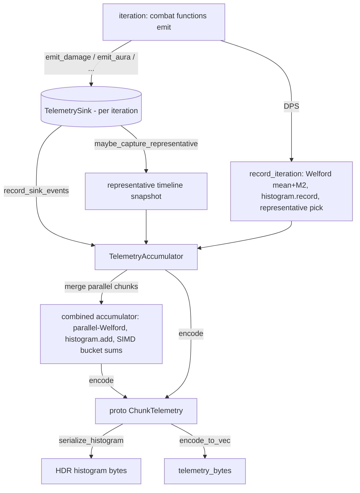

A single run produces a DPS number, but a useful sim produces a distribution: a mean and its error, per-spell breakdowns, buff uptimes, resource accounting, and a representative timeline to look at. The engine collects all of that incrementally as it runs, never holding more than one iteration's worth of fine-grained events in memory at a time.

The shape is two layers. Each iteration fills a `TelemetrySink` with raw events; after the iteration, those events are folded into a `TelemetryAccumulator` that carries running aggregates across iterations. The sink is cleared and reused; the accumulator grows. At the end, the accumulator encodes itself into protobuf bytes: the `ChunkTelemetry` that travels back to the rest of the platform.

## The two layers

`TelemetrySink` is the per-iteration collector. It is a bundle of pre-allocated vectors, one per event category, that the combat functions emit into during a run:

{/* docref struct metrics-telemetry-sink */}

It is allocated once per chunk and cleared at the start of each iteration, so the hot path appends without allocating.

`TelemetryAccumulator` is the cross-iteration aggregate. It holds the DPS statistics as streaming state, a count, a sum, min and max, and a running Welford pair (mean plus `M2`, the sum of squared deviations) alongside an auto-resizing HDR histogram that each iteration records into directly. There is no growing vector of per-iteration DPS values: the running pair and the histogram are both O(1) per iteration in memory. Around those sit the per-spell aggregates, aura uptimes, resource totals, per-second damage buckets, the direct/periodic/pet damage split, and the representative iteration's captured timeline:

{/* docref struct metrics-telemetry-accumulator */}

The handoff happens in the loop's post-iteration tail. After a run finishes, the loop computes the iteration's DPS and calls three accumulator methods in order: `record_sink_events` to fold this iteration's sink into the running totals, `record_iteration` to update the DPS statistics, and `maybe_capture_representative` to possibly snapshot this iteration's timeline.

<Figure id="metrics-pipeline">

</Figure>

This figure expands the **telemetry** box of the [sim-pipeline figure](/dev/bible/engine/discrete-event-simulation). The flow:

- During an iteration the combat functions push into the sink (`emit_damage`, `emit_aura`, `emit_resource`, and so on).
- `record_sink_events` folds the iteration's events into the accumulator's running totals, and buckets damage into per-second slots. The timeline's resolution is one second (`TIMELINE_BUCKET_MS`).
- `record_iteration` updates the Welford mean and `M2`, records the iteration's DPS into the histogram, and retains its lightweight deterministic identity as a representative candidate.
- `merge` combines two accumulators when chunks run in parallel, via parallel-Welford on the running pair plus `histogram.add`, and joins their representative candidates.
- `encode` produces the protobuf, serialising the already-built histogram and packing every aggregate.

## The representative iteration

A run does thousands of iterations, but you can only show one timeline. Which one? After all chunks are merged, the accumulator picks the iteration whose DPS is **closest to the final aggregate mean**. Equal-distance candidates use their deterministic seed prefix and iteration index as a stable tie-break:

{/* docref code metrics-representative-pick */}

The execution layer then reruns exactly that deterministic iteration and installs its timeline (cast markers, damage markers, aura windows, cooldown windows) without changing the aggregate statistics. Each marker carries a typed `MarkerKind` enum (`Cast`, `Damage`, `Resource`, `Proc`) rather than a raw integer tag, so the kind survives the trip to the portal as a named value the consumer can match on.

Picking the mean-nearest iteration rather than the best or worst is deliberate: a timeline shown to a user should be typical, not a lucky outlier. Selecting only after the final merge makes the result exact for the complete run instead of whichever chunk-local mean happened to choose it first.

## Statistics and convergence

The DPS statistics accumulate incrementally with a streaming Welford update: each iteration adjusts the running mean and the running sum of squared deviations (`M2`) in constant time, from which the variance and standard deviation fall out as `M2 / n` without a second pass. The standard deviation feeds the adaptive early-exit in the [chunk loop](/dev/bible/distribution/orchestration): the loop periodically computes the relative standard error of the mean and stops once it drops below the requested `target_error`, so a chunk runs exactly as many iterations as it needs for the requested precision and no more.

When chunks run in parallel (every sim now fans out through the application's parallel runner, with one thread as the degenerate single-chunk case), each thread builds its own accumulator and they are combined with `merge`. Merging combines the two Welford pairs with the parallel-Welford formula (`M2 = M2_a + M2_b + delta^2 * n_a * n_b / n`), which recovers the exact combined variance without ever holding the raw values, folds one chunk's histogram into the other with `histogram.add`, sums the per-spell and resource aggregates, adds the per-second bucket sums with a SIMD helper, and re-selects the representative against the combined mean. This is what lets a sim split across cores and still report one coherent distribution.

## The protobuf encoding

The final step is `encode`, which consumes the accumulator and produces the `ChunkTelemetry` protobuf bytes. The HDR histogram is already built, recorded into one sample at a time during the run, so `encode` only serialises it to the `hdrhistogram` V2 byte format rather than scanning a value vector. It then emits the per-spell action rows, the aura and resource and cooldown rows, the execution and damage-profile data, the per-second bucket sums, and the representative timeline snapshot, then serialises the whole thing with prost's `encode_to_vec`.

Two encoding details matter for fidelity. DPS and damage values are scaled by ten (`PROTO_DPS_SCALE`) and resource values by a hundred (`PROTO_RESOURCE_SCALE`) before being rounded into integers, so a decimal place of precision survives the integer wire format. And the histogram is HDR and auto-resizing rather than a fixed-bin histogram, so it records the DPS distribution across its full range at consistent relative precision without committing to bucket boundaries up front, which is exactly what makes recording it incrementally safe: there is no known-range problem to solve before the first iteration runs.

Those bytes are the `telemetry_bytes` of a `ChunkReport`. From here the data leaves the engine entirely, decoded in the [portal](/dev/bible/portal/simulation-ui) for charts, or merged across chunks by the [orchestration](/dev/bible/distribution/orchestration) and [hosted-compute](/dev/bible/distribution/hosted-compute) layers for a full-job result.
