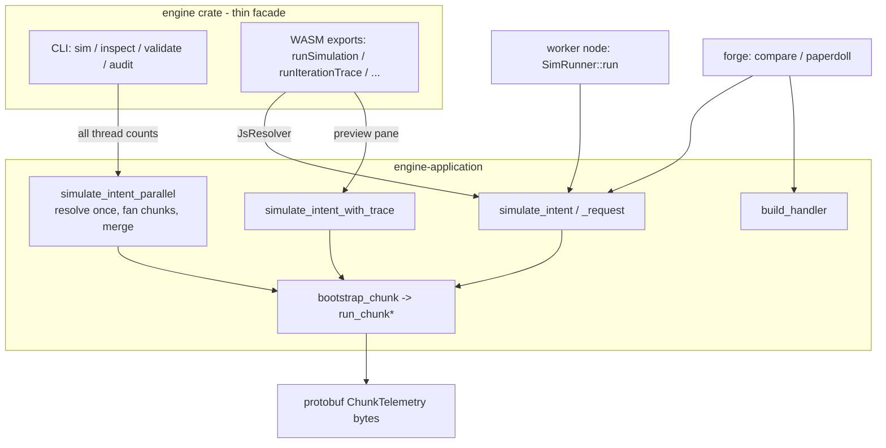
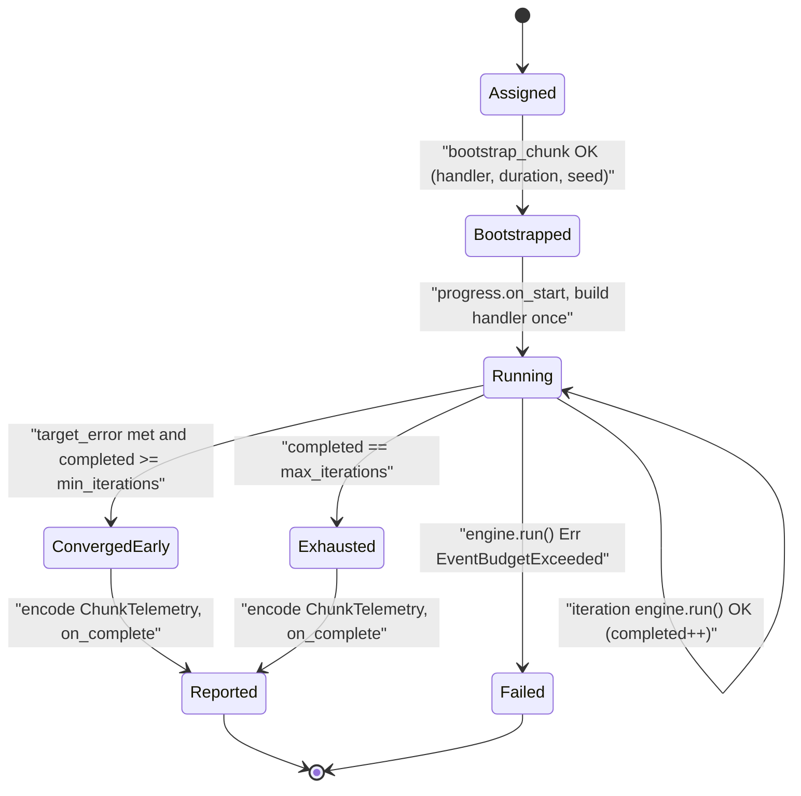

Every caller that wants a simulation result goes through one small family of application entries, all funnelling into the same spine. The single-chunk entry is `simulate_intent`: you hand it a TOML config, a chunk description, a seed, a data resolver, and a progress sink, and it hands back protobuf telemetry bytes. The browser, a hosted compute node, and the forge comparison tool drive a chunk at a time through it. The CLI, which owns a whole local run rather than one assigned chunk, goes through `simulate_intent_parallel`, which resolves game data once and fans the run out across threads as one chunk each before merging. Either way, everything between config-in and bytes-out is `bootstrap` (turn config + game data into a ready handler) followed by `run_chunk` (drive that handler through N iterations).

`simulate_intent` lives in the `engine-application` crate, the layer that sits between the host shells and the pure simulation core. Its job is orchestration, not simulation: parse and validate the intent, resolve all game data through the <Term id="resolver">`DataResolver`</Term> port, build the per-spec <Term id="spec-handler">`SpecHandler`</Term>, then loop the core engine and accumulate <Term id="telemetry">telemetry</Term>.

## The pipeline

The figure below expands the **Engine** box of the system-context diagram. It is the Zoom-1 `sim-pipeline` figure; this page owns the Zoom-2 view of its **run_chunk loop** box, the [chunk lifecycle](#the-chunk-as-a-state-machine) state machine at the end.

There are five public entry functions, and they all funnel into the same `bootstrap_chunk` → `run_chunk*` spine:

<BibleTable id="simulate-intent-entries">

| Function                     | Purpose                                                                                                         | Drives                       |
| ---------------------------- | --------------------------------------------------------------------------------------------------------------- | ---------------------------- |
| `simulate_intent`            | Convenience entry. Wraps args into a `SimRequest` with default overrides, then calls `simulate_intent_request`. | `run_chunk`                  |
| `simulate_intent_request`    | Canonical entry taking a `SimRequest<'_>` envelope.                                                             | `run_chunk`                  |
| `simulate_intent_parallel`   | Whole-run entry. Resolves data once, fans iterations across threads as one chunk each, merges, encodes.         | `run_chunk_into_accumulator` |
| `simulate_intent_with_trace` | Trace-mode entry for the in-browser preview pane; attaches a `DecisionTraceSink`.                               | `run_chunk_with_trace`       |
| `build_handler`              | Builds a handler without running iterations (forge `paperdoll`). Runs `on_sim_start` once.                      | none                         |

</BibleTable>

The signature of the convenience entry is the contract every host meets:

{/* docref fn overview-arch-simulate-intent */}

`simulate_intent` wraps its arguments into a `SimRequest` with `IntentOverrides::default()` and delegates to `simulate_intent_request`, whose body is the whole layer in two lines: `bootstrap_chunk` then `run_chunk`.

## The facade is thin

The `engine` crate itself is a thin facade with two mutually exclusive personalities, a CLI binary and the WASM bindings, gated by Cargo features. Neither owns any simulation logic. Both translate their host's inputs into a call on `engine-application` and render whatever comes back. The CLI calls `simulate_intent_parallel`; the WASM exports call `simulate_intent` (and `simulate_intent_with_trace` for the preview pane). The native worker node and forge skip the facade entirely and call the application directly. The diagram below shows the convergence:

<Figure id="engine-facade">

</Figure>

Keeping the facade thin took deliberate work. Sim-config assembly now lives in a `SimConfigIntent` constructor (`SimConfigIntent::patchwerk`) rather than the CLI hand-building TOML; the rotation-fallback policy and the manifest-directory audit walk moved into `engine-application`; and the preview pane injects its rotation through an `IntentOverrides::rotation_id_override` field instead of parsing and re-serialising the config TOML. What is left in `engine` is genuinely shell: argument parsing, output formatting, and the JS bridge.

## bootstrap: config and game data become a handler

`bootstrap` is where the cost lives. It is async because game-data resolution is async. In order, it:

1. Parses the TOML into a `SimConfigIntent` and validates `intent_version == "v1"`, the spec id, a non-empty `rotation_id`, and the fight `duration_s` against `1.0..=MAX_DURATION_S` (1800 s).
2. Resolves the buff toggles, bloodlust, flask (defaults on), augment rune (defaults on), tempered pre-pot, and race, all suppressed when `overrides.no_buffs` is set.
3. Looks up the spec through Ports' canonical `ContentCatalog` and its validated `descriptor(spec)` API.
4. Fetches the rotation JSON through the resolver.
5. Turns gear into stats, either `compute_stats_from_gear` (the real pipeline) or `bench_gear_result` (default stats), both yielding a `GearResult`.
6. Assembles the full list of extra spell ids to resolve, item-effect spells, set-bonus auras, the on-toggle buff spells, the racial, and the codegen-emitted item resolve ids, then decodes talents.
7. Calls `resolve_game_data`, the big async pass that introspects the spec to discover its spell/aura ids and resolves every one into a `ResolvedGameData` ([data resolution](/dev/bible/game-data/data-resolution) covers this in detail).
8. Builds the handler by calling the descriptor's `handler_factory` with a 15-field `HandlerParams`.

The output is a single `Box<dyn SpecHandler>`. `bootstrap_chunk` wraps it together with the parsed duration and the effective seed, `seed_base.wrapping_add(chunk.seed_offset)`, into a `ChunkBootstrap`. The seed offset is how distinct chunks of the same job produce uncorrelated Monte-Carlo streams from one master seed.

## run_chunk: one handler, N iterations

A <Term id="chunk">chunk</Term> is the atomic unit of distribution. It declares how many iterations to run and, optionally, an early-exit error target. `run_chunk` builds the handler exactly once, allocates one `EventQueue` and one `TelemetrySink`, and reuses them across every iteration. Only `handler.reset()` and `queue.clear()` run between iterations:

{/* docref code orchestration-iteration-reset */}

That is a deliberate trade. It makes a chunk cheap to run a thousand times but means the handler must scrub all its per-iteration state in `reset`.

Each iteration `i`:

1. Builds a deterministic RNG from `SimRng::from_prefix(seed_prefix, i)`, where `seed_prefix` is an FNV-1a hash of `seed_base` and the chunk id, computed once.
2. Constructs a `SimEngine` over the shared refs and calls `engine.run()`, one full combat run.
3. Records the iteration's DPS into the one `TelemetryAccumulator`.

Every `CHECK_INTERVAL = 100` iterations (and on the last), the loop computes a running relative standard error and, if the chunk carries a `target_error` and has passed `min_iterations`, breaks early once the error falls below the target. This adaptive early-exit is why a chunk's declared `iterations` is a ceiling, not a fixed count. When the loop ends, the accumulator encodes into a protobuf `ChunkTelemetry`, which becomes the `telemetry_bytes` of the returned `ChunkReport`.

`ChunkAssignment` and `ChunkReport` are defined in `engine-ports`, not here. The application layer only consumes them. The assignment is what the coordinator hands a node, and it carries everything the loop needs:

{/* docref struct orchestration-chunk-assignment */}

The `permutation_index` is set for tournament and factorial work and `None` for a uniform split; the `min_iterations`/`max_iterations`/`target_error` triple drives the adaptive early-exit above. `ChunkReport` is the small envelope back: `job_id`, `chunk_id`, `chunk_index`, and `telemetry_bytes`.

## The chunk as a state machine

<Figure id="chunk-lifecycle">

</Figure>

The `Failed` edge is the one failure the executor surfaces directly. If any iteration's event loop exceeds `MAX_EVENTS = 500_000`, `engine.run()` returns `SimRunError::EventBudgetExceeded`, which `run_chunk` maps to `EngineError::SimulationRuntime` and the whole chunk fails. There is no per-iteration recovery. One runaway iteration kills the chunk, and on the distributed path the chunk is later reclaimed and re-enqueued.

## Native callers vs the WASM caller

The contract is the same everywhere, but how the resolver is built differs.

**Native hosts** construct a Rust `DynDataResolver` and call one of the application entries directly. The worker node's `SimRunner::run` builds a `ChunkAssignment::single_indexed("", chunk_index, iterations)` and calls `simulate_intent` over a `SupabaseResolver`, because the coordinator already split the job into chunks before handing one to the node. The CLI is different: it owns the whole local run, so it calls `simulate_intent_parallel` for _every_ thread count. That function resolves game data once, fans the iterations out into one chunk per thread on a rayon pool, and merges the per-thread accumulators into a single encoded result. A single-threaded CLI run is just the degenerate one-chunk case of that same function, not a separate code path. The old hand-rolled CLI parallel runner (which bootstrapped once and reimplemented chunk-splitting and accumulator merging inside the `engine` crate, complete with its own `unsafe impl Send`) is gone; the split/seed/merge contract now lives in `simulate_intent_parallel` alone. Forge uses `simulate_intent` for its SimC comparison provider and `build_handler` for `paperdoll`.

**The WASM host** cannot pass a Rust resolver. Instead the browser hands in a JS object, which `JsResolver` adapts into a `DataResolver`, and the WASM export calls the _same_ `simulate_intent`. The preview pane is the only caller of `simulate_intent_with_trace`; the explicit trace request invokes the private structural reference while leaving portable bytecode as the ordinary WASM executable. That JS resolver and the worker plumbing around it are the subject of the next page, the [WASM boundary](/dev/bible/distribution/wasm-boundary).
