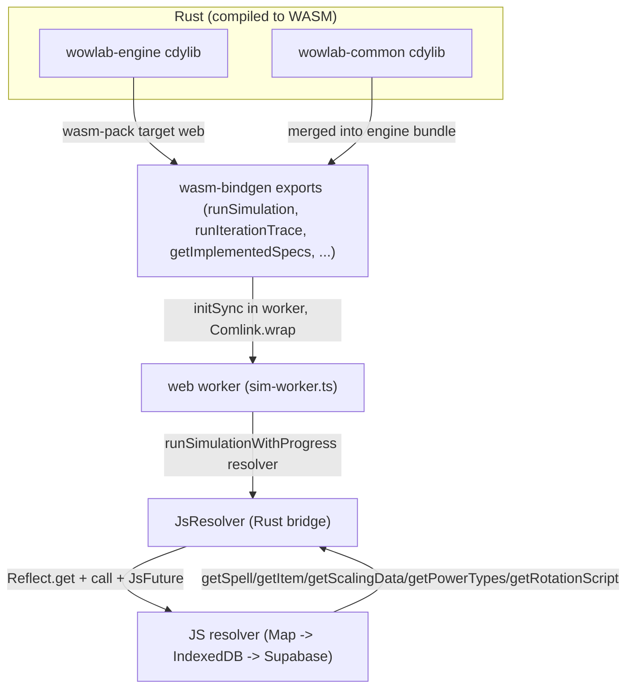
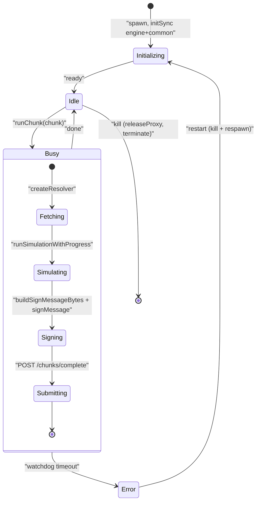

The same Rust engine that runs on a hosted node also runs in your browser tab. Two crates, `wowlab-engine` and `wowlab-common`, compile to WebAssembly, and the simulation runs in a [web worker](https://developer.mozilla.org/en-US/docs/Web/API/Web_Workers_API) rather than on the main thread, so a long sim never freezes the UI. Game data the engine needs is fetched back across the boundary through a JavaScript callback object.

This page expands the **Browser** box of the system-context diagram. The figure below is the Zoom-1 `wasm-boundary` figure; this page also owns the Zoom-2 `worker-pool-state` view of its **web worker** box.

<Figure id="wasm-boundary">

</Figure>

## What compiles, and what it exports

The engine crate is built `crate-type = ["rlib", "cdylib"]`; the `cdylib` is what produces the `.wasm`. Its WASM module is gated behind both `target_arch = "wasm32"` and a `wasm` feature, and it force-links generated content so the single content-catalog registration survives dead-stripping. There is no LLVM in the browser, so the WASM build uses the portable bytecode runtime. See the [rotation compiler](/dev/bible/engine/rotation-compiler).

The engine's WASM module has six submodules, `init`, `metadata`, `rotation`, `simulation`, `paperdoll`, `error`, and exports these functions across the boundary:

<BibleTable id="wasm-exports">

| Export (js_name)                        | Module     | Async? | What it does                                                              |
| --------------------------------------- | ---------- | ------ | ------------------------------------------------------------------------- |
| `runSimulation`                         | simulation | yes    | Runs a chunk, returns protobuf `ChunkTelemetry` bytes                     |
| `runSimulationWithProgress`             | simulation | yes    | Same, plus a per-tick JS progress callback; returns `{bytes, chunkIndex}` |
| `runIterationTrace`                     | simulation | yes    | One traced iteration through the explicit structural reference path       |
| `getImplementedSpecs`                   | metadata   | no     | Array of implemented specs (id, class, slug, counts)                      |
| `getSpecIntrospection`                  | metadata   | no     | Spell/aura names with zeroed values (empty game data)                     |
| `getSpecIntrospectionResolved`          | metadata   | yes    | Introspection with real resolved values                                   |
| `validateRotation`                      | rotation   | no     | Structural rotation validation                                            |
| `validateRotationForSpec`               | rotation   | no     | Spec-aware validation (resolves spell/aura/talent names)                  |
| `getFieldDescriptors`                   | rotation   | no     | The rotation field schema for a spec                                      |
| `getEngineVersion` / `getEngineGitHash` | metadata   | no     | Build identity                                                            |

</BibleTable>

The parse, build, and decode helpers a host also needs, `parseSimc`, `buildSimConfig`, `decodeJobResult`, `decodeAndDerive`, `resolveItem`, are **not** in the engine crate. They live in `wowlab-common`. Because `wowlab-engine` depends on `wowlab-common` with the `wasm` feature, the engine bundle's `.d.ts` re-exports all of them too, so the engine package is a superset. Studio nonetheless imports parse/decode/build from the `wowlab-common` package and sim/trace/metadata from `wowlab-engine`. The [content system](/dev/bible/portal/content-system) and [simulation UI](/dev/bible/portal/simulation-ui) consume these on the main thread.

The TypeScript types on both sides are generated by `tsify` (the maintained crate, not the unmaintained `tsify-next`), so the Rust types that cross the boundary, including the `ValidationError` union returned by `validateRotationForSpec`, become exact `.d.ts` shapes. That union is itself a faithful mirror of the Rust enum: it carries every variant, including the newer `MaxDepthExceeded` (a condition tree nested past the recursion bound) and `UnknownField` (a field name no domain descriptor knows), so the editor can render each error case without a stringly-typed fallback.

When the module instantiates, `init_wasm_runtime` runs once as the `#[wasm_bindgen(start)]` hook: it calls the WASM constructors, installs a panic hook, force-links the generated specs, and logs the build identity. It does **not** assert the registry is populated, because a `start` function cannot return a `Result` and a panic there would hard-abort the module with no catchable error on the JS side. The empty-registry check is split out into a separate export the loader calls right after instantiation:

{/* docref code wasm-boundary-init-runtime */}

`assertRegistryReady` returns `Result<(), JsError>`, so an engine that links but registers no specs surfaces as a rejected promise the loader can report, rather than a wedged module. The reasoning is unchanged, fail loud on a broken registry rather than return empty results later, but the failure is now a catchable error instead of a module abort. Separately, the installed panic hook posts engine panics back to the worker host via `self.postMessage({ type: "wowlab:engine-panic" })`, so a crash inside the WASM module surfaces as a message on the main thread instead of a silent wedge.

## The build pipeline

`pnpm build` runs `buildCommon` then `buildEngineWasm`, each calling `buildWasmPkg`. The pipeline is:

1. `wasm-pack build --target web` produces an ESM module with an async `default()` init and a synchronous `initSync({module})`.
2. Stamp the package version to `{baseVersion}-{sha256(bg.wasm).slice(0,12)}`, a content hash so a changed engine busts caches.
3. `pnpm pack` the tarball into `packages/archives`, then rewrite `apps/studio/package.json`'s `file:` dependency to point at it.

Studio's `predev`/`prebuild` then run `sync:wasm`, which copies both `.wasm` blobs into `apps/studio/public/wasm/` under content-hashed names and writes a `manifest.json` mapping `engineWasm`/`commonWasm` to their hashed URLs. The browser reads that manifest to fetch the right bytes.

## Loading: default() on main, initSync() in workers

The main thread loads each module lazily as a singleton: `await import("wowlab-engine")` then `await m.default()`, which fetches and instantiates the `.wasm`. The `WasmIsland` provider gates this behind a mount check and a `WebAssembly.Module` support probe, then exposes `useCommon()`/`useEngine()` to consumers for synchronous main-thread calls like parse and decode.

Workers take a different path. The pool fetches the `.wasm` bytes once on the main thread and `Comlink.transfer`s the `ArrayBuffer`s into each worker zero-copy. Each worker then instantiates each module synchronously from the bytes it was handed, guarded so a repeat `init()` is a no-op. Both modules follow the same shape:

{/* docref code wasm-boundary-worker-init */}

So the main thread uses `default()`, which is async and fetches, and workers use `initSync()`, which is synchronous and reads transferred bytes. The split avoids re-fetching the same `.wasm` per worker.

## The JS resolver protocol

The engine never reaches the network itself. Inside `run_simulation` it wraps the JS object the host passed in with `JsResolver::new`, then erases it to a `DynDataResolver`. `JsResolver` implements the Rust `DataResolver` trait by reflecting on the JS object: every call does `Reflect::get`, casts to a `js_sys::Function`, calls it, casts the result to a `Promise`, and awaits via `JsFuture`:

{/* docref fn wasm-boundary-resolver-call */}

All deserialization is `serde_wasm_bindgen`, no JSON roundtrip. The trait methods are thin wrappers over this one helper.

The JS object must implement five methods: `getSpell(id)` returns `SpellDataFlat`, `getItem(id)` returns `ItemDataFlat`, `getScalingData()` returns `ItemScalingData`, `getPowerTypes()` returns the power-type list, and `getRotationScript(id)` returns a string. The studio implementation backs each method with the same 3-layer read-through cache the resolver chapter describes: an in-memory `Map`, then IndexedDB keyed under `patch-v1:`, then Supabase PostgREST. A spell or item resolved by one chunk is cheap for the next.

## The worker pool

The sim path runs in a pool of workers, each created with `new Worker(new URL("sim-worker.ts", ...), { type: "module" })` and wrapped with `Comlink.wrap`. The `WorkerManager` defaults are a watchdog of `120_000` ms, `maxWorkers` 8, and `poolSize` 4; the auto worker count is `min(navigator.hardwareConcurrency, maxWorkers)`.

A single slot's life looks like this:

<Figure id="worker-pool-state">

</Figure>

Inside `runChunk`, the worker builds a resolver, calls `runSimulationWithProgress` whose progress callback updates live counters and emits per-phase metrics (`fetching`, `simulating`, `signing`, `submitting`); on the Rust side `JsProgressSink` logs a failed progress callback via `console_error` rather than swallowing it silently. The worker then normalizes the returned `{bytes, chunkIndex}` to a `Uint8Array`, signs the body with the node keypair via `buildSignMessageBytes` + `signMessage`, and POSTs the protobuf to the sentinel's `/chunks/complete` with the `X-Node-Key`/`X-Node-Sig`/`X-Node-Ts` headers. That Ed25519 signing and the sentinel side of the handshake are covered under [hosted compute](/dev/bible/distribution/hosted-compute); the browser is just one more signing node.

The watchdog is the resilience mechanism. Each slot arms a `setTimeout`; every progress beat re-arms it. If a slot goes silent past the timeout, a wedged sim, an engine panic, or a hung fetch, the manager marks it errored and restarts the whole pool: it rejects pending work, releases the Comlink proxy, and terminates the worker. This is coarse, one stuck slot restarts all of them, but it keeps a single bad chunk from silently stalling the contribution loop, and the chunk it dropped is reclaimed by the sentinel for another node.
