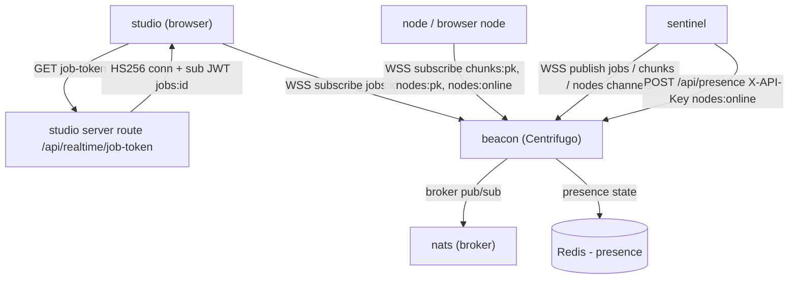

Three parties never talk to each other directly: the user's browser, the sentinel scheduler, and the compute nodes. They communicate through a pub/sub message bus. That bus is <Term id="beacon">beacon (Centrifugo)</Term>, a [Centrifugo](https://centrifugal.dev) v6 server that nodes and browsers connect to over WebSocket and that the sentinel publishes through. Work assignments, live job progress, and node-online state all ride channels on this one server.

This page expands the **beacon** box of the system-context diagram. The figure below is the Zoom-1 `realtime-topology` figure.

<Figure id="realtime-topology">

</Figure>

## Two backends, two jobs: NATS and Redis

Centrifugo is the front door, but two other services back it, and they do different things. The broker, the thing that fans a publication out to every subscriber, is **NATS**: beacon's config sets the broker `type` to `nats` with url `nats://wowlab-nats.internal:4222`. The presence manager, the thing that tracks who is currently subscribed to a channel, is **Redis**: the same config sets the presence-manager `type` to `redis`, with the address injected from `CENTRIFUGO_PRESENCE_MANAGER_REDIS_ADDRESS`.

So both <Term id="nats">NATS</Term> and <Term id="redis">Redis</Term> back beacon, for different subsystems. NATS is the message broker on the realtime hot path; it is its own Fly app co-located with beacon, pinned to region `lhr`. Redis is the presence store; it is external to the repo's deploy directory, so only the env var name lives here. This split is why the presence question has two answers: ask "what fans out messages?" and it is NATS; ask "who is online?" and it is Redis.

## The channel namespace

Centrifugo declares three namespaces, `nodes`, `jobs`, and `chunks`, and every channel is one of these prefixes plus an id. The full set, with who publishes and who listens:

<BibleTable id="centrifugo-channels">

| Channel                  | Direction        | Publisher                                   | Subscriber                             |
| ------------------------ | ---------------- | ------------------------------------------- | -------------------------------------- |
| `chunks:{nodePublicKey}` | server → node    | sentinel scheduler                          | node; browser node                     |
| `nodes:{nodePublicKey}`  | server → node    | sentinel presence                           | node                                   |
| `nodes:all`              | server → clients | sentinel presence                           | studio fleet UI                        |
| `nodes:online`           | presence         | (no publish; join/leave)                    | node + studio; sentinel reads via HTTP |
| `jobs:{jobId}`           | server → browser | sentinel scheduler and chunk-complete route | studio                                 |
| `jobs:all`               | server → clients | sentinel chunk-complete route               | admin overview UI                      |

</BibleTable>

`chunks:{nodePublicKey}` is the work pipe: the sentinel publishes a `RuntimeChunkPayload` to a specific node's channel and only that node is subscribed to it. `jobs:{jobId}` is the progress pipe back to the browser. `nodes:online` is special. Nobody publishes to it; a node _appears_ in it by subscribing with `join_leave(true)`, and that subscription is what makes the node show up in Centrifugo presence. The sentinel does not subscribe to `nodes:online` over WebSocket; it reads the roster over the HTTP API (see below).

All publication funnels through one method: `ServerState::publish<T>(channel, payload)` serializes to JSON, then calls `centrifuge.publish` with up to `PUBLISH_RETRIES = 3` retries, backing off only on temporary errors:

{/* docref code realtime-publish-funnel */}

Every `jobs:*`, `chunks:*`, and `nodes:*` message the sentinel sends goes through that one funnel.

## How presence is actually read

The sentinel keeps the database `nodes.status` in sync with reality on a 30-second cron. The presence job asks Centrifugo who is online, but over the HTTP API, not a subscription. It sends `POST /api/presence` with the `X-API-Key` header for channel `nodes:online` and parses the returned user set into node public keys:

{/* docref fn realtime-presence-read */}

It then diffs that set against the DB online set and writes the difference back. Nodes that newly appear get marked online; nodes that vanished get marked offline, and each change publishes a `nodes:all` and `nodes:{pk}` update plus a Discord notification. The HTTP API key here is a third secret, distinct from the JWT secret below: `CENTRIFUGO_HTTP_API_KEY` on beacon, configured as `SENTINEL_CENTRIFUGO_KEY` on the sentinel.

## Two token systems

Connecting to beacon and subscribing to a channel both require a JWT. There are two distinct minting paths.

**Connection and subscription JWTs are HS256**, signed with a single shared HMAC secret, `CENTRIFUGO_CLIENT_TOKEN_HMAC_SECRET_KEY` on beacon. The sentinel mints its own connection token for subject `"sentinel"` and the node beacon tokens it hands out on register and refresh, all through `token::generate(subject, secret)` with a one-day TTL.

The browser path is stricter because a user must not be able to watch another user's job. The studio server route `GET /api/realtime/job-token?jobId=` first requires an authenticated Supabase user, then verifies that user _owns_ the requested job by checking `jobs.user_id`, and only then mints **two** HS256 tokens: a connection token and a per-channel subscription token whose `channel` claim scopes the browser to exactly one `jobs:{id}` channel.

{/* docref code realtime-job-token-route */}

These browser tokens carry a 10-minute TTL, far shorter than the node tokens' day. The Centrifugo namespace config enforces the gate from the other side: the `jobs` namespace allows publish for clients but requires a subscription JWT to subscribe, so a forged or missing subscription token cannot join a `jobs:` channel.

This is the trade chosen over a chattier model: rather than have the sentinel authorize every subscription, ownership is checked once at token-mint time and the short TTL bounds how long a leaked token is useful.

**Node request signing is Ed25519, and it is a separate system.** It secures the sentinel's HTTP API, not the realtime bus. That belongs to [hosted compute](/dev/bible/distribution/hosted-compute), where the node protocol lives. The two systems never overlap: HS256 JWTs let you onto beacon; Ed25519 signatures let you call the sentinel.

## The Rust client

Both the sentinel and the node speak to beacon through `crates/centrifuge`, a Rust port of centrifuge-js over WebSocket with the protobuf protocol. Its `Client` spawns a self-reconnecting task with full-jitter backoff and refreshes the connection JWT through a `get_token` callback both at connect and mid-session before the TTL expires. On the node side, `get_token` is wired to `sentinel.refresh_token()`, so a node's beacon token auto-refreshes through the sentinel without the node holding the HMAC secret.

Once connected, the node opens its three subscriptions in one place: its config channel, its work channel, and the presence channel with `join_leave(true)`:

{/* docref code realtime-node-subscribe */}

The browser side is the mirror of this. It passes its `getToken` callbacks straight to the `Centrifuge` JS client, which fetches a fresh connection and subscription token from the ownership-checked route whenever it needs one.
