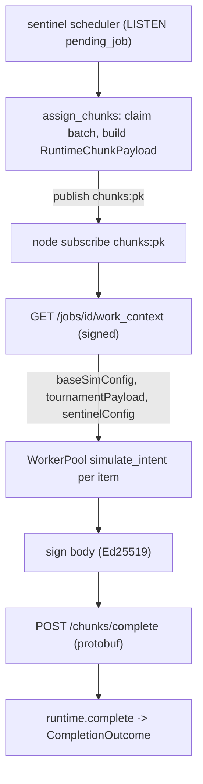
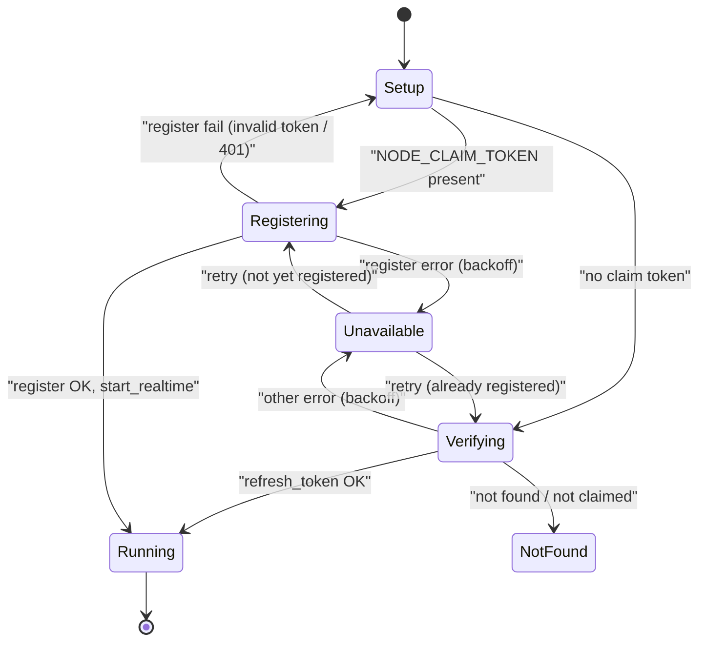
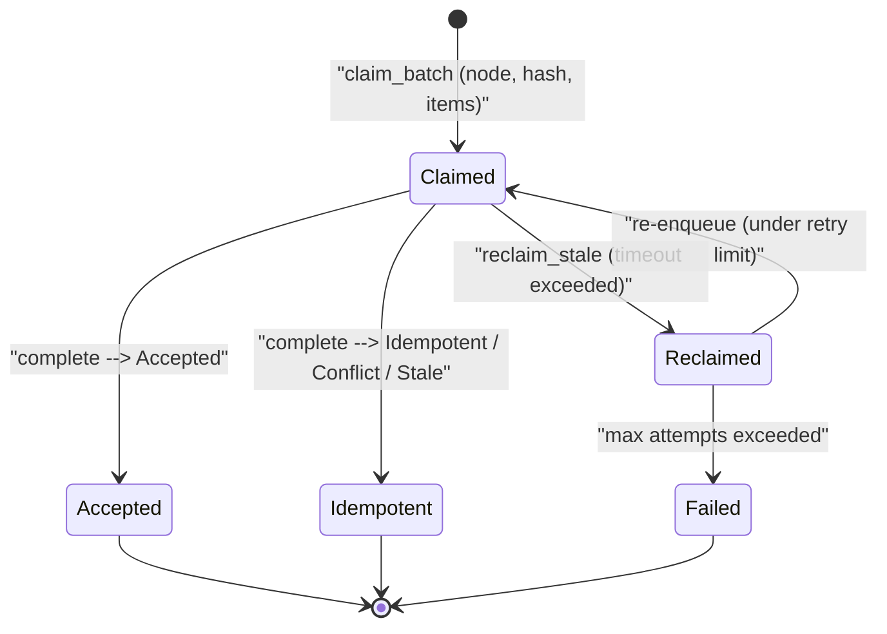

A simulation job is too big to run in one place, so it is split into chunks and farmed out to whatever compute is online: a hosted Fly node, a contributor's desktop, or a browser tab. The <Term id="sentinel">sentinel</Term> is the scheduler that does the splitting and assigning; a <Term id="node">node</Term> is anything that can run the engine and sign its results. This page is the full hosted loop: how the sentinel picks up a job, hands a chunk to a node, verifies what comes back, and recovers when a node disappears.

This page expands the **Nodes** box of the system-context diagram. The figure below is the Zoom-1 `hosted-compute-flow` figure; this page also owns the Zoom-2 `node-state` view of its **node** box and the Zoom-2 `chunk-claim-lifecycle` view of its **claim** box.

<Figure id="hosted-compute-flow">

</Figure>

## The scheduler: from NOTIFY to assignment

The sentinel runs four long-lived tasks in one process: the Discord bot, the scheduler, the cron runner, and the HTTP server, multiplexed with `tokio::select!`. The scheduler is the one that turns jobs into work.

It picks up jobs through Postgres `LISTEN/NOTIFY`. `listen_and_assign` connects a `PgListener` and listens on the channel `pending_job` (singular). When a NOTIFY arrives it debounces 50 ms and runs `process_pending`; it also runs `process_pending` on a 30-second timeout as a safety net so a missed NOTIFY never strands a job. `process_pending` fetches pending jobs and hands them to `assign_chunks`, which is where a job becomes chunks:

1. For each fetched job it parses the sentinel config, builds an in-memory `JobRuntime`, inserts it into the runtime store, and flips the DB row `pending → running`. The split strategy depends on the config: `"single"` uniform splits at `DEFAULT_TARGET_CHUNK_ITERATIONS = 50_000`, `"tournament"` builds laddered phases, `"stat_weights"` builds a baseline plus four perturbation runs.
2. It fetches the online nodes (`status = 'online'`, joined to Discord identities) and computes each node's capacity as `min(max_parallel, total_cores)`.
3. It sorts jobs by priority and, per job, picks the best eligible node by `(eligibility priority, available capacity)`. The `Priority` ladder is `Public = 1 < Friends = 2 < Discord = 3 < Own = 4`, higher wins.
4. It <Term id="claim">claims</Term> a batch from the runtime with `runtime.claim_batch(node_key, max_items, now)` and publishes a `RuntimeChunkPayload` to that node's `chunks:{public_key}` channel. If the job was newly running, it also publishes a `jobs:{id}` "running" progress event so the browser sees it start.

## The node protocol

A node is event-driven and polled every 100 ms by its host binary. Its lifecycle:

<Figure id="node-state">

</Figure>

A node with a `NODE_CLAIM_TOKEN` goes straight to `Registering`; one without it goes to `Verifying` to check it was already claimed. The state machine is a flat enum, matched exhaustively by both host binaries:

{/* docref enum hosted-compute-node-state */}

On reaching `Running`, `start_realtime` fetches a beacon token and subscribes to **three** channels: `chunks:{pk}` for work, `nodes:{pk}` for config updates, and `nodes:online` with join/leave for presence.

When a chunk arrives on `chunks:{pk}`, `process_chunk` does two things. First it fetches the <Term id="work-context">work context</Term>, the heavy shared part of the job (base sim config, tournament payload, sentinel config), through a signed `GET /jobs/{id}/work_context?hash=&claim_token=`, cached per chunk so the same job's later chunks reuse it. Then it builds a `WorkBatch` and hands it to the `WorkerPool`. The pool is a tokio `Semaphore` bounded by the node's enabled core count; each work item runs `SimRunner::run_item`, which derives the per-item config and calls `simulate_intent` over a `SupabaseResolver`. This is the same [orchestration entry](/dev/bible/distribution/orchestration) the browser uses, just driven by a Rust resolver instead of a JS one.

## Signing and completion

Every node-to-sentinel HTTP request is Ed25519-signed; the result POST is no exception. The node's `RequestSigner` signs with its persisted 32-byte keypair over a canonical message that both sides build the same way:

{/* docref fn hosted-compute-sign-message */}

The signature, public key, and timestamp travel in the `X-Node-Sig`, `X-Node-Key`, and `X-Node-Ts` headers. The sentinel's `verify_node` middleware rebuilds the same message, rejects a clock skew over 300 s, checks the 64-byte signature against the public key, and on success attaches a `VerifiedNode` extension. It runs over _all_ node-API routes, not just completion, so there is no chunk-specific check.

`POST /chunks/complete` carries a protobuf `BatchChunkCompletion` body, not JSON. The body itself is not separately signed; integrity comes from the Ed25519 signature over the body plus the `claim_token`/`work_context_hash` matched against the live in-memory claim. The handler decodes the protobuf, validates the 32-byte hash, maps results, and calls `runtime.complete(...)`, which returns a `CompletionOutcome`:

<BibleTable id="completion-outcomes">

| `CompletionOutcome`         | Meaning                                                             | HTTP |
| --------------------------- | ------------------------------------------------------------------- | ---- |
| `Accepted { job_complete }` | Results recorded; `job_complete` true triggers finalize             | 200  |
| `Idempotent`                | Duplicate of an already-accepted completion (same token, same hash) | 200  |
| `Conflict(msg)`             | Token matched a prior completion but with different results         | 409  |
| `Stale(msg)`                | No matching active claim (already reclaimed, expired, or unknown)   | 410  |

</BibleTable>

`Accepted { job_complete: false }` publishes a progress tick to `jobs:{id}`; `job_complete: true` runs `finalize_job`, which writes `result_pb`/`timeline_pb` to Postgres via `jobs_finalize.sql`, removes the runtime from the store, and publishes a "completed" event to both `jobs:{id}` and `jobs:all`. The `Conflict` and `Stale` outcomes are the idempotency guard: a node that retries after a timeout, or one that completes a chunk already reclaimed to someone else, gets a clean 409/410 instead of corrupting the aggregate.

## The claim lifecycle and reclaim

A claim is the sentinel's record that a specific node holds a specific chunk. It is created at assignment, resolved at completion, and swept by a cron if it goes stale:

<Figure id="chunk-claim-lifecycle">

</Figure>

The `claim_batch`, `complete`, and `reclaim_stale` methods all live on the in-memory `JobRuntime`. Each in-flight chunk is one `ClaimRecord`:

{/* docref struct hosted-compute-claim-record */}

The reclaim cron runs once a minute: it sweeps every runtime job and calls `runtime.reclaim_stale(now, timeout, max_attempts)` with a default 5-minute timeout and 3 attempts. A claim past its timeout but under the retry limit is re-enqueued for another node; one past `max_attempts` logs a failure event; a job whose claims have all permanently failed is marked `Failed` in the DB and publishes a "failed" event to `jobs:{id}` and `jobs:all`. This is the recovery path for the `Failed` chunk edge in [orchestration](/dev/bible/distribution/orchestration): a node that crashes mid-chunk simply stops reporting, its claim ages out, and the work moves on.

## Burst compute

Online nodes are not always enough. The sentinel can rent bare-metal capacity from [Latitude.sh](https://www.latitude.sh) when the queue backs up. A `queue_depth` cron sums the in-flight chunk count across runtime jobs into a `pending_chunks_gauge`, and the `BurstScheduler` cron reads that gauge to decide how many burst nodes to run. It computes a target from pending depth, floor capacity, and per-node throughput, clamps it to `burst_max_nodes` (default 5), and reconciles: scale up provisions a server via the Latitude REST API; scale down kills only nodes that are below target _and_ older than 55 minutes, to avoid paying for a fresh hourly server it just started. A provisioned burst node boots from a cloud-init template that joins the headscale tailnet and runs the node container, picking up the same claim-token registration path as any other node. The infrastructure side of this, Fly, Cloudflare, headscale, and Latitude, is the next page, [deployment](/dev/bible/distribution/deployment).

## Why the runtime store is in memory

The whole in-flight picture, which chunks exist, who claims them, partial results, lives only in the sentinel's process memory; only the final `result_pb`/`timeline_pb` ever reach Postgres. The cost is real: if the sentinel restarts, that state is gone, so on boot it fails any job left `running` and logs it as dropped. The benefit is that the hottest loop in the system, claim, complete, reclaim, every few seconds across many jobs, never touches the database. The [database chapter](/dev/bible/distribution/database) examines this trade-off and the schema split it produces.
