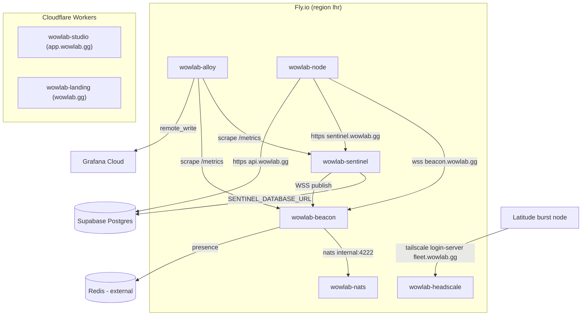

The platform runs on three hosts. The two Next.js apps run on Cloudflare's edge. The backend services all run on Fly.io in one region: scheduler, realtime bus, broker, log shipper, mesh control plane, and the standing compute fleet. The database is Supabase. Everything else hangs off those.

This page expands the **Infra** box of the system-context diagram. The figure below is the Zoom-1 `fly-topology` figure.

<Figure id="fly-topology">

</Figure>

## The six Fly apps

Every backend service is its own Fly app, and all of them are pinned to `lhr` (London) so the realtime hot path, scheduler, broker, and bus, stays intra-region:

<BibleTable id="fly-apps">

| Fly app            | Image                             | Internal port | Role                                        |
| ------------------ | --------------------------------- | ------------- | ------------------------------------------- |
| `wowlab-sentinel`  | `ghcr.io/legacy3/wowlab-sentinel` | 8080          | Scheduler, HTTP API, Discord bot, MCP, cron |
| `wowlab-beacon`    | `centrifugo/centrifugo:v6`        | 8000          | Centrifugo realtime bus                     |
| `wowlab-nats`      | `nats:2.12-scratch`               | 4222          | Message broker for beacon                   |
| `wowlab-headscale` | `headscale/headscale:stable`      | 8080          | Tailscale control plane (`fleet.wowlab.gg`) |
| `wowlab-alloy`     | `grafana/alloy:latest`            | n/a           | Metrics/log shipper                         |
| `wowlab-node`      | `ghcr.io/legacy3/wowlab-node`     | n/a           | Standing compute fleet                      |

</BibleTable>

The app names and region come straight from each app's `fly.toml`. The realtime three, sentinel, beacon, and nats, all set `min_machines_running = 1` and turn auto-stop off, because a scheduler or bus that scaled to zero would drop the live loop. beacon and nats are co-located deliberately: nats is the broker beacon fans messages through, so the latency between them is on the critical path. The sentinel image is a distroless `cc-debian13:nonroot` carrying a prebuilt binary, nothing else in the container.

Redis, the fourth backing service from the [realtime chapter](/dev/bible/distribution/realtime), is _not_ a Fly app. It is external, referenced only by the `CENTRIFUGO_PRESENCE_MANAGER_REDIS_ADDRESS` env var on beacon. So the realtime tier is five Fly apps plus one external Redis.

## The edge: Cloudflare and Supabase

The user-facing apps do not run on Fly. `studio` (the authenticated app) and `landing` (the marketing site) are Next.js apps deployed to Cloudflare Workers via OpenNext, on custom domains `app.wowlab.gg` and `wowlab.gg`. Both use `nodejs_compat`, an R2 bucket for the OpenNext cache, and Durable Objects for queue and tag-cache handling. A third worker, `og`, generates Open Graph images. The studio app is the only one that holds the realtime job-token HMAC secret, since it is what mints browser subscription tokens. The [realtime chapter](/dev/bible/distribution/realtime) covers that minting.

The database is Supabase Postgres, reached two ways. The sentinel connects directly via `SENTINEL_DATABASE_URL`, with `sslmode=require` forced on, for the `LISTEN/NOTIFY` loop and SQL. Nodes use Supabase PostgREST at `https://api.wowlab.gg` for read-only game data. The [database chapter](/dev/bible/distribution/database) covers the schema.

## The mesh: headscale and burst

Standing Fly nodes reach the sentinel, beacon, and Supabase over the public internet with signed requests. Burst nodes and externally-provisioned boxes get a private mesh instead. `wowlab-headscale` is a self-hosted Tailscale control plane serving `fleet.wowlab.gg`, backed by a persistent volume for its sqlite database.

The whole isolation model lives in the ACL policy. The `admin` group reaches everything and can SSH as root into any `tag:node` machine, but nodes get no peer ACL at all, so they cannot reach each other or the admin box over the tailnet:

{/* docref code deployment-headscale-acls */}

That is the point: a contributor's burst box can be reached for admin and can reach out to the sentinel, but it is not a lateral path to anything else.

A burst node provisioned by the sentinel's `BurstScheduler` (see [hosted compute](/dev/bible/distribution/hosted-compute)) boots from a cloud-init template that writes its claim token and node name, installs Docker and Tailscale, joins the tailnet at `https://fleet.wowlab.gg` with `--advertise-tags=tag:node`, runs the node container as a systemd service, and locks down SSH and the firewall to tailscale-only ingress. The template ships with `__CLAIM_TOKEN__` and `__TS_AUTHKEY__` placeholders that `render_user_data` fills at provision time before base64-encoding the result for cloud-init:

{/* docref fn deployment-render-user-data */}

A one-time manual provisioning script, `ubuntu-setup.sh`, does the same for a box you set up by hand.

## Observability

`wowlab-alloy` runs Grafana Alloy and scrapes the internal Fly DNS of the sentinel and beacon `/metrics` endpoints every 30 seconds, then `remote_write`s to Grafana Cloud. Both the sentinel and beacon expose Prometheus metrics. The sentinel installs its recorder at startup and beacon has Prometheus enabled in its config. Keeping alloy in `lhr` is what lets it reach those services over `*.internal` DNS rather than the public network.
