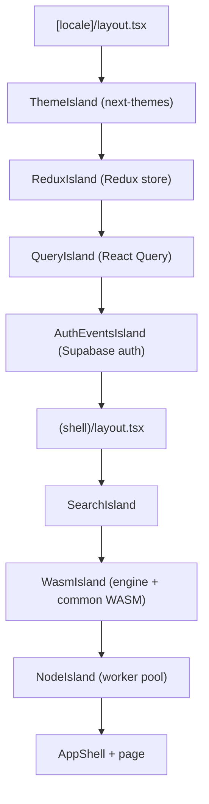

The portal is the studio app at `app.wowlab.gg`. It is a Next.js App Router project that renders mostly static, server-rendered shells and then mounts a small number of <Term id="island">islands</Term>, focused `"use client"` providers, only where interactive features (state, queries, the WASM engine, the compute node) actually need them. Everything else stays a server component.

I lean on this split because the heavy machinery is expensive to boot and pointless on a marketing or docs page: the engine compiled to WebAssembly, the React Query cache, the Redux store. Wrapping it in islands keeps that cost off the pages that do not need it.

## App Router and locale routing

Routes live under `apps/studio/src/app/[locale]`. The `[locale]` segment is the first dynamic param; `generateStaticParams` enumerates the configured locales and the layout rejects anything outside that set with `notFound()`. Copy is wired through intlayer: the layout wraps children in `IntlayerServerProvider` and `IntlayerClientProvider`.

Under the locale, route groups separate concerns without adding URL segments:

- `(shell)`: the authenticated app shell (sidebar, header, the WASM and node islands).
- `(shell)/(core)`: the user-facing features: `simulate`, `rotations`, `rankings`, `journal`, `plan`.
- `(shell)/dev`: the docs and this bible, rendered from MDX.
- `preview/`: standalone, `force-static` pages embeddable in an iframe.

## PPR is off, deliberately

Partial Prerendering / `cacheComponents` is disabled. The config keeps it commented out with the reason inline:

{/* docref code portal-arch-ppr-off */}

It breaks on the Cloudflare `workerd` runtime, a `setTimeout` trap, and it is mutually exclusive with the OpenNext cache interception the app relies on. So the honest statement is: the portal does not use PPR. It does use the React Compiler and OpenNext to deploy to Cloudflare Workers.

What it leans on instead of PPR is `generateStaticParams` for the MDX routes, so the bible and docs prerender every slug, plus per-page `Cache-Control` headers: immutable for the hashed `.wasm` files, short-lived for `manifest.json`, `stale-while-revalidate` for the `preview` pages.

## The island providers

Two layers compose the providers. The locale layout mounts the always-on ones; the shell layout adds the heavy ones.

<Figure id="portal-island-tree">

</Figure>

The locale layout nests `ThemeIsland` → `ReduxIsland` → `QueryIsland` → `AuthEventsIsland` around its children. Each is a thin `"use client"` wrapper: `QueryIsland` is a `QueryClientProvider` over a lazily-built singleton client; `ReduxIsland` is `react-redux`'s `Provider` over the simulator store; `ThemeIsland` wraps `next-themes`.

The shell layout adds the expensive ones, nested `SearchIsland` → `WasmIsland` → `NodeIsland`. This placement matters: only the authenticated shell pays for the WASM engine and the worker pool, and `NodeIsland` lives inside `WasmIsland` because the node connection needs the loaded modules.

A handful of islands are scoped even more tightly. `NuqsIsland`, the `nuqs` URL-state adapter, is not mounted globally. It is wrapped locally around the components that read query params, such as `UrlTabs`.

### WasmIsland gating

`WasmIsland` is the gate for everything that calls into the engine. It does three things before exposing the modules. First it waits for client mount via `useSyncExternalStore` so the server never tries to load WASM. Then it feature-detects WebAssembly by instantiating a minimal module, the eight magic bytes of an empty `.wasm`:

{/* docref code portal-arch-wasm-detect */}

Only then does it load both bundles under a `Suspense` boundary, running `useSuspenseQuery` for `getEngine` and `getCommon`. The loaded `{ common, engine }` pair is published on a context read by `useEngine()` and `useCommon()`, both of which throw if used outside the island. The crossing into WebAssembly is the subject of its own section in [the WASM boundary](/dev/bible/distribution/wasm-boundary); here it is just one more provider.

This is the parent of the per-feature views the rest of this section covers: [state management](/dev/bible/portal/state-management), [the rotation editor](/dev/bible/portal/rotation-editor), [the simulation UI](/dev/bible/portal/simulation-ui), and [the content system](/dev/bible/portal/content-system) that renders this very page.
