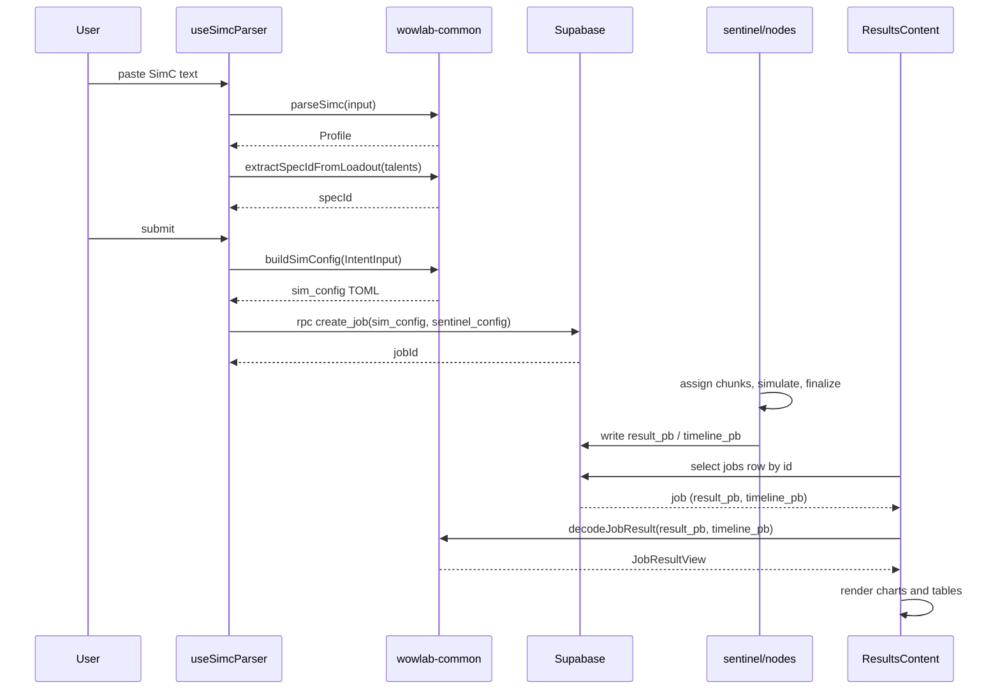

The simulate section has three modes, all starting from the same input, a pasted SimulationCraft profile, and all ending at the same results page. The difference is what they search over: **quick** runs one fixed gear set, **bags** (best-in-bags) runs a tournament over the items in your bags, and **drops** ranks unobtained loot. From the browser's point of view the flow is the same: parse the profile, build a sim config, create a job, watch it run, then decode and chart the result.

The simulate index just links the three modes. The interesting path is the data flow underneath them.

<Figure id="browser-sim-flow">

</Figure>

This figure expands the **Browser** box of the system-context diagram (in [the overview](/dev/bible/overview/architecture)) for the simulation use case specifically. The `sentinel + nodes` step is shown collapsed here; its internals are [hosted compute](/dev/bible/distribution/hosted-compute).

## SimC paste to spec detection

Parsing happens on the main thread, synchronously, against the loaded `wowlab-common` module. `useSimcParser` debounces 300 ms, then calls `parseSimcProfile(common, input)` to get a `Profile` and `extractSpecIdFromLoadout(common, profile.talents.encoded)` to recover the spec id from the talent string. The detected spec is gated against the engine's implemented specs, built once from `parseImplementedSpecs(common, engine.getImplementedSpecs())`, so an unsupported spec produces a clear error instead of a failed sim. On a successful, supported parse it dispatches the spec id and a rotation reset into the Redux simulator slice.

## Building the sim config

Before submission the profile becomes a TOML sim config. `buildProfileSimConfig` maps the profile's equipment into the engine's `IntentInput` shape, packs in the talent loadout, the chosen `rotation_id`, the spec id, and any settings, then calls `buildSimConfig`, which lives in `wowlab-common` and returns the TOML string:

{/* docref fn sim-ui-build-profile-config */}

The equipment mapping is the only fiddly part: each item carries its `bonus_ids`, `gem_ids`, `enchant_id`, `crafted_stats`, `crafting_quality`, `drop_level`, `slot`, and `id`, which is everything the engine needs to resolve the item back to stats on its side.

## Job submission

Both quick and bags submit through `useJobSubmission`, which routes to `useSubmitJob` when no slot is contested and `useSubmitBibJob` when there are tournament slots. Either path builds the sim config, builds a sentinel config with `buildSentinelConfig`, calls the `create_job` RPC on Supabase, and on success navigates to the results page for the returned job id.

The difference is in the sentinel config. Quick runs a flat set of iterations at a `target_error` of `0.05`. Bags tightens that to `0.005` and adds a staged tournament: each phase runs more iterations against a shrinking pool of survivors, so cheap early rounds cull the obvious losers before the expensive rounds decide the winner.

{/* docref code sim-ui-bib-tournament-phases */}

There is a second execution path worth mentioning: the browser can itself be a compute node. The same worker pool that runs distributed chunks is described in [the WASM boundary](/dev/bible/distribution/wasm-boundary); this page concerns the path where the job is submitted and executed by the hosted pool.

## Live progress

While a job is `pending` or `running`, the results page shows live progress from the realtime channel. `ResultsProgressSection` calls `useJobProgress(jobId, { isEnabled })`, which subscribes the browser to the `jobs:{jobId}` channel on beacon (Centrifugo). The browser never holds the signing secret: it fetches two short-lived HMAC tokens, a connection token and a per-channel subscription token, from an ownership-checked server route, `GET /api/realtime/job-token`. Each publication carries chunk counts, phase, and for tournaments a live top-K ranking that the section renders as it ticks in. If the channel errors, `isFailed` flips and the caller falls back to the 3000 ms `useJob` poll. The realtime topology is detailed in [the realtime section](/dev/bible/distribution/realtime).

## Decoding and rendering results

When the job has finished, `result_pb` and `timeline_pb` are present on the `jobs` row. `ResultsContent` loads the row with `useJob` and decodes it with `decodeJobResult(common, job)`, memoized so it only re-runs when the job or module changes. That helper hands the protobuf payloads, hex-encoded `bytea` straight out of Postgres, to `wowlab-common`, which decodes them on the Rust side and returns a `JobResultView`.

The view is a tagged union, discriminated on `kind`:

{/* docref enum sim-ui-job-result-view */}

A `single` job carries one `AnalyticsView`; a `tournament` job carries the tournament ranking plus an optional baseline `AnalyticsView`. `ResultsContent` branches on `jobResult.kind` and renders accordingly: the throughput chart, the DPS stats card from `analytics.core`, the spell-breakdown table from `analytics.actions`, the sim-config card, and for tournaments the ranking view. Every view struct (`AnalyticsView`, `CoreView`, `DistributionView`, the per-spell `ActionView`) is produced by the common WASM decode, so the UI does no statistics itself. It only renders the decoded view.
