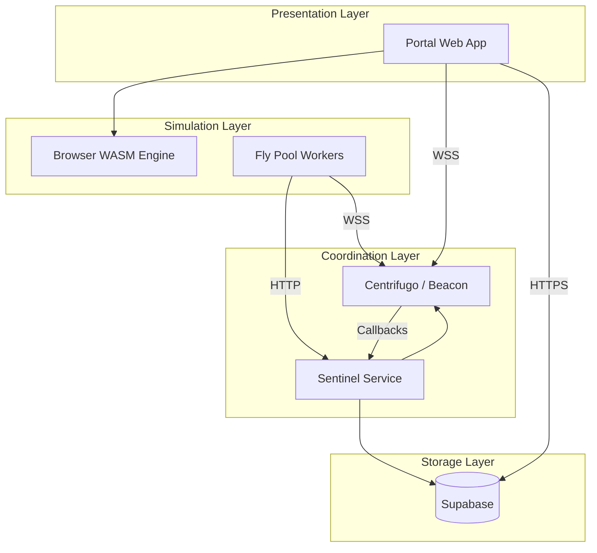

# System Architecture

WoW Lab splits simulation between the browser (free tier) and a hosted Fly pool (paid tiers). The portal orchestrates both paths through the same job records.

## Component Overview

## Layer Responsibilities

| Layer        | Component | Responsibility                                  |
| ------------ | --------- | ----------------------------------------------- |
| Presentation | Portal    | UI, browser simulation, result visualization    |
| Coordination | Sentinel  | Job scheduling, pool worker health              |
| Coordination | Beacon    | WebSocket connections, realtime messaging       |
| Simulation   | Browser   | WASM engine for free-tier sims                  |
| Simulation   | Pool      | Native engine workers on Fly for paid-tier sims |
| Storage      | Supabase  | User data, rotations, jobs, results             |

## Simulation Request

Free tier:

1. User submits sim in the portal
2. The browser WASM engine runs it locally
3. Results stream back into the UI as the browser completes chunks

Paid tier:

1. User submits sim in the portal
2. Portal creates a job record in Supabase
3. Sentinel assigns chunks to pool workers via Beacon
4. Workers run chunks and post results
5. Sentinel aggregates results into the job record
6. Portal subscribes to the job and updates live

## Domain Services

| Domain               | Service    | Purpose                                   |
| -------------------- | ---------- | ----------------------------------------- |
| `api.wowlab.gg`      | Supabase   | Portal database, auth, user data          |
| `sentinel.wowlab.gg` | Sentinel   | Pool coordination HTTP API                |
| `beacon.wowlab.gg`   | Centrifugo | WebSocket connections, realtime messaging |
