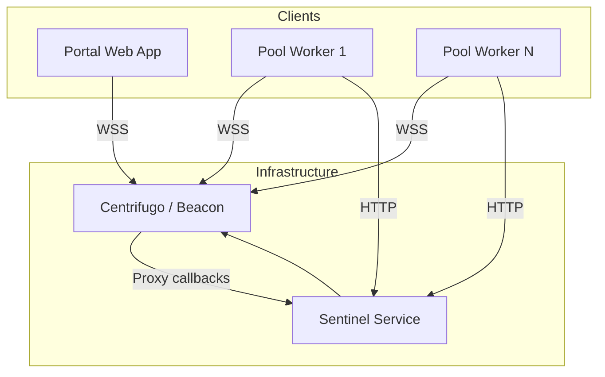

# Realtime Infrastructure

The realtime layer pushes job progress to the portal as it happens and hands chunks to pool workers the moment they're ready.

## Connection Architecture

## Channel Structure

Centrifugo organizes communication through channels:

| Channel Pattern | Purpose                 | Subscribers                 |
| --------------- | ----------------------- | --------------------------- |
| `job:{id}`      | Job progress updates    | Portal clients watching job |
| `node:{id}`     | Pool worker assignments | Single pool worker          |
| `broadcast`     | System announcements    | All connected clients       |

## Message Flow

### Progress Updates

1. Pool worker completes chunk processing
2. Worker publishes progress to `job:{id}` channel
3. Centrifugo delivers to all subscribers
4. Portal updates progress UI in realtime

### Job Assignment

1. Sentinel picks a ready pool worker
2. Sentinel publishes chunk assignment to `node:{id}`
3. Worker receives assignment and begins processing
4. Worker acknowledges receipt via HTTP callback

## Scaling

<CardGrid>
  <Card title="Horizontal Scaling">
    Centrifugo instances share state and can scale behind a load balancer.
  </Card>
  <Card title="Connection Limits">
    Each Centrifugo instance handles ~100k concurrent connections.
  </Card>
</CardGrid>
