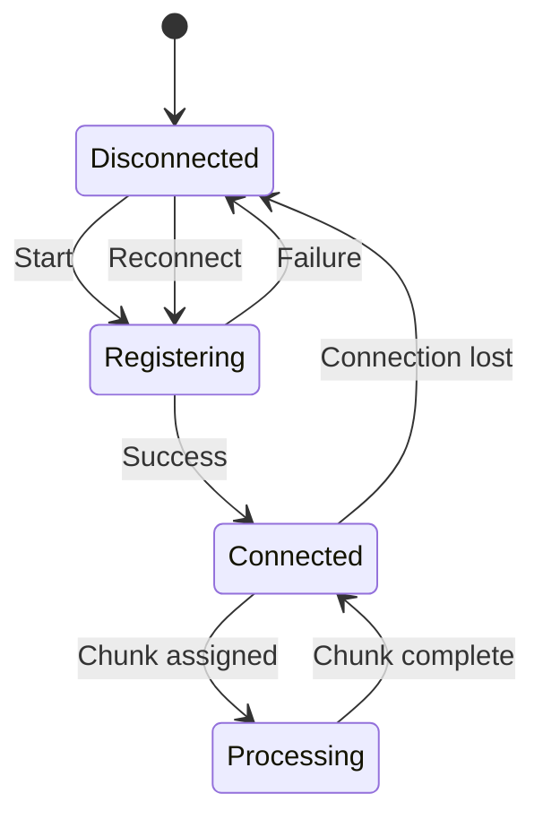

# Pool Worker Protocol

Pool workers are the Fly-deployed binaries that run paid-tier sims. They talk to Sentinel over HTTP for lifecycle and Centrifugo over WebSocket for chunk assignments. Browser WASM workers use a different path and do not speak this protocol.

## Authentication

Pool workers authenticate with Ed25519 signatures:

<Steps>
  <Step step={1} title="Key Generation">
    Worker generates an Ed25519 keypair on first boot. Private key is persisted
    to the worker's data volume.
  </Step>
  <Step step={2} title="Registration">
    Worker sends its public key to Sentinel via HTTP POST.
  </Step>
  <Step step={3} title="Token Acquisition">
    Sentinel returns a signed JWT for the Centrifugo connection.
  </Step>
  <Step step={4} title="Connection">
    Worker connects to Centrifugo with the JWT and subscribes to its assignment
    channel.
  </Step>
</Steps>

## HTTP Endpoints

| Endpoint          | Method | Purpose                     |
| ----------------- | ------ | --------------------------- |
| `/register`       | POST   | Initial worker registration |
| `/token`          | POST   | Refresh Centrifugo JWT      |
| `/heartbeat`      | POST   | Health check with metrics   |
| `/chunk/complete` | POST   | Report chunk completion     |

## Message Types

### Inbound (to Worker)

```json
{
  "type": "chunk_assign",
  "job_id": "uuid",
  "chunk_id": 42,
  "config": { ... },
  "iterations": 1000
}
```

### Outbound (from Worker)

```json
{
  "type": "chunk_progress",
  "job_id": "uuid",
  "chunk_id": 42,
  "completed": 500,
  "total": 1000
}
```

## Error Handling

<Alert title="Retry Policy">
  Workers retry failed HTTP requests with exponential backoff. Maximum 5 retries
  with a 30 second cap.
</Alert>

## Connection Lifecycle


